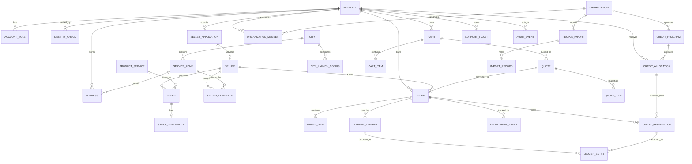

# مدل دامنه و ERD حنا — پیش‌نویس ۰.۱

**مرجع:** [معماری نسخه کامل](HANA-FULL-PRODUCT-NATIONAL-ARCHITECTURE-v1.0.md)  
**وضعیت:** پیشنهادی؛ D01 تک‌فروشنده‌ای طبق [ADR-001](../adr/ADR-001-SINGLE-SELLER-ORDER.md) و اختیار مشتری در انتخاب فروشنده با سبد ناقص طبق [ADR-002](../adr/ADR-002-CUSTOMER-CHOICE-PARTIAL-BASKET.md) تصویب شده‌اند؛ مدل مالی و موجودی پس از تعیین باقی D02–D06 نهایی می‌شود. این سند نام جدول SQL یا migration نهایی نیست.

## قواعد پایه
- هویت حساب، احراز هویت، صلاحیت فروشندگی، سازمان، وضعیت حمایتی و نقش دسترسی مفاهیم مستقل‌اند.
- فروشنده و سازمان با `account_id` یا `representative_id` مرتبط‌اند اما مالکیت مستقل دارند.
- خرید حقوقی ویژگی سفارش و گیرنده فاکتور است، نه ورود خریدار به پرتال سازمان.
- موجودی و قیمت در سطح **پیشنهاد قابل عرضه یک فروشنده** ثبت می‌شود؛ کاتالوگ مرجع با پیشنهاد فروشنده متفاوت است.
- سفارش و مبلغ در زمان ثبت snapshot می‌شوند؛ تغییر قیمت بعدی سفارش قبلی را تغییر نمی‌دهد.
- پول در ریال صحیح؛ تاریخ‌ها UTC؛ نمایش زمان و تومان در کلاینت.
- `city_id` و `service_zone_id` زمینه خدمت‌رسانی بر اساس نشانی **تحویل** هستند، نه صرفاً محل سکونت حساب.
- اطلاعات هویتی حساس با شناسه داخلی ارجاع داده شود؛ شماره ملی و تلفن نباید کلید عمومی URL یا گزارش باشند.

## ERD مفهومی هسته

در نمودار، `QUOTE → ORDER` و `SELLER_APPLICATION → SELLER` رابطه منطقی‌اند. طبق ADR-001، هر `ORDER` دقیقاً یک `SELLER` دارد و تمام `ORDER_ITEM`ها به همان فروشنده تعلق دارند؛ `QUOTE` نیز یک فروشنده منتخب دارد. هر خرید از فروشنده دیگر سفارش مستقل می‌سازد. جزئیات cardinality سایر روابط تا تصویب قواعد مرتبط در migration تثبیت نمی‌شود.

## تکمیل دامنه کیف پول و درخواست عودت

طبق [ADR-014](../adr/ADR-014-WALLET-REFUND-OPTIONAL-CASHOUT.md) مدل مفهومی افزون بر ledger و credit فعلی به `WALLET_ACCOUNT`، `WALLET_TRANSACTION`، `REFUND`، `WITHDRAWAL_REQUEST` و `WITHDRAWAL_ATTEMPT` یا معادل نرمال‌شده نیاز دارد. موجودی نقدی قابل استرداد، وجه رزروشده برای برداشت و اعتبار حمایتیِ محدود، **یک موجودی قابل نقدسازی واحد نیستند**. cardinality و migration دقیق بعد از قرارداد مالی تثبیت می‌شوند؛ این یادداشت تأیید قطعی SQL schema نیست.

## گزارش کسری/خرابی و عکس مشتری

طبق [ADR-021](../adr/ADR-021-ITEM-SHORTAGE-DAMAGE-PHOTO-SELLER-RESOLUTION.md)، `ORDER_INCIDENT` باید `incidentType`, `orderItemId`, `affectedQuantity`,  `reportedBy`, `supportReviewState`, `sellerReturnState` و پیوند به `INCIDENT_ATTACHMENT` (عکس) و `ITEM_RETURN` (در صورت دریافت کالای خراب) داشته باشد یا معادل نرمال‌شده آن‌ها را فراهم کند. تأیید/رد پشتیبانی حنا، ارجاع و هماهنگی با فروشگاه، مأمور/زمان دریافت فیزیکی توسط خود فروشگاه و هر refund به همان قلم/تعداد و ledger مرتبط شوند؛ طبق [ADR-023](../adr/ADR-023-SUPPORT-APPROVAL-SELLER-COLLECTS-DAMAGED-GOODS.md)، مرجوعی کالای خراب نباید `deliveryJobId` جدید در لجستیک حنا ایجاد کند؛ طبق [ADR-022](../adr/ADR-022-ITEM-ISSUE-REFUND-TO-WALLET-OPTIONAL-WITHDRAWAL.md) بخش نقدی refund کسری/خرابی ابتدا به `WALLET_ACCOUNT` قابل برداشت مشتری می‌رود و بخش اعتبار محدود به همان منبع بازمی‌گردد؛ عودت بانکی فقط با `WITHDRAWAL_REQUEST` جداگانه مشتری است. طبق [ADR-024](../adr/ADR-024-IMMEDIATE-WALLET-REFUND-ON-APPROVED-DAMAGE.md)، در خرابی تأییدشده، رویداد `SUPPORT_APPROVED_REFUND`/معادل باعث refund و بستانکاری کیف پول می‌شود؛ `ITEM_RETURN.sellerCollectedAt` پیش‌شرط ایجاد refund نیست و تأخیر فروشگاه نباید آن را معلق کند. طبق [ADR-025](../adr/ADR-025-SELLER-COLLECTS-DAMAGED-RETURN-WITHIN-ONE-HOUR.md)، `ITEM_RETURN` یا معادل آن باید `sellerReturnSlaStartAt`, `sellerReturnDueAt`, `sellerCollectedAt` و `slaBreachedAt` را با مبدأ مصوب ثبت کند؛ مقدار SLA یک ساعت و مبدأ آن `supportApprovedAt` است: `sellerReturnSlaStartAt = supportApprovedAt` و `sellerReturnDueAt = supportApprovedAt + 60 minutes`؛ ابلاغ دیرهنگام نباید مبدأ را تغییر دهد. طبق [ADR-026](../adr/ADR-026-SELLER-PENALTY-FOR-LATE-DAMAGED-RETURN.md)، ثبت تخلف و `SELLER_PENALTY`/معادل باید به `ITEM_RETURN`، فروشگاه و سفارش متصل و idempotent باشد؛ طبق [ADR-027](../adr/ADR-027-LATE-DAMAGED-RETURN-PENALTY-EQUALS-ITEM-PRICE.md)، مبلغ جریمه معادل قیمت کالای خرابِ مرتبط است و باید به snapshot قیمت `ORDER_ITEM` مرتبط باشد؛ طبق [ADR-028](../adr/ADR-028-PENALTY-USES-ACTUAL-ORDER-ITEM-PRICE.md) snapshot قیمت واقعی `ORDER_ITEM` بعد از تخفیف مبناست، نه قیمت فهرست روز یا فقط سهم پرداخت نقدی؛ جزئیات تخصیص تخفیف سبدی هنوز باز است؛ طبق [ADR-029](../adr/ADR-029-DEDUCT-LATE-RETURN-PENALTY-FROM-SELLER-SETTLEMENT.md)، جریمه با `SETTLEMENT_DEDUCTION` جداگانه و `settlementId` به تسویه همان فروشگاه وصل و یک بار کسر می‌شود؛ تا پیش از تسویه مبلغ فاکتور در جریان مالی حناست و کسر جریمه به تسویه همان فاکتور مرتبط می‌شود؛ تکلیف جریمه پس از پرداخت واقعی تسویه یا کسری ناشی از سایر کسورات باز است و نباید ledger ساختگی یا تسویه منفی ایجاد شود.

## تأیید عدم‌تحویل پس از handoff

طبق [ADR-020](../adr/ADR-020-FULL-REFUND-ON-CONFIRMED-NONDELIVERY.md)، `ORDER_INCIDENT`/شکایت عدم‌تحویل باید به `ORDER` و `DELIVERY_JOB_REFERENCE` مرتبط شود و نتیجه بررسی جدا از وضعیت لغو پیش از handoff نگهداری شود. `REFUND` با کلید idempotency وابسته به `incidentId + orderId + reason` و ledger مربوط، فقط بعد از تأیید عدم‌تحویل ساخته می‌شود. استرداد بخش نقدی به کیف پول و بازگشت اعتبار محدود به منبع خود به ترتیب ADR-014 و قرارداد اعتبار انجام می‌شود. این تکمیل مفهومی است و migration نهایی نیاز به قرارداد مالی/عملیاتی دارد.

## مرز تراکنش‌ها و constraints

| موضوع | قید الزامی |
|---|---|
| Account | شناسه داخلی immutable، حذف/ناشناس‌سازی فقط طبق سیاست مصوب |
| Seller activation | دسترسی پنل فقط پس از تصمیم نهایی و حساب فعال |
| Organization scope | `organization_id` بر داده و authorization در هر query و عمل حساس |
| Offer & Inventory | موجودی منفی و رزرو تکراری ممنوع؛ کالای ناموجود از خرید قطعی حذف/نیازمند تصمیم |
| Quote | `quote_id`، version، `expires_at` و snapshot هزینه ارسال/اقلام؛ `delivery_total_irr` و سهم خریدار/فروشنده جدا، شناسه/نسخه تعرفه لجستیک طبق [ADR-006](../adr/ADR-006-LOGISTICS-DELIVERY-FEE-SPLIT.md)؛ سبد اولیه با اقلام قابل تأمین فروشنده منتخب یکی فرض نشود؛ اقلام ناموجود و تأیید آگاهانه مشتری پیش از ایجاد سفارش ثبت/قابل اثبات باشد؛ انتخاب مشتری برای نگه‌داشتن/حذف اقلام تأمین‌نشده از سبد آینده طبق [ADR-003](../adr/ADR-003-CUSTOMER-CONTROL-UNFULFILLED-CART-ITEMS.md) مستقل ثبت شود |
| Order | state transition مجاز و immutable monetary snapshot؛ `request_id` یکتا |
| Payment | `attempt_id` و reference PSP با unique index؛ webhook تکراری بدون تکرار ledger |
| Seller Settlement | سهم حمل فروشنده طبق [ADR-007](../adr/ADR-007-SELLER-DELIVERY-SHARE-DEDUCTED-AT-SETTLEMENT.md) به‌صورت کسر مجزای مرتبط با سفارش و فروشنده، فقط یک بار از تسویه حنا؛ جریمه دیرکرد جمع‌آوری خرابی طبق [ADR-029](../adr/ADR-029-DEDUCT-LATE-RETURN-PENALTY-FROM-SELLER-SETTLEMENT.md) به‌صورت ردیف کسر مجزا و یک‌باره از تسویه فروشگاه؛ قواعد وضعیت پس از پرداخت واقعی تسویه فاکتور و کسری ناشی از سایر کسورات/لغو تا تصویب قرارداد باز |
| Ledger | رکورد افزایشی immutable، اصلاح با entry جبرانی؛ کنترل جمع بدهکار/بستانکار |
| Credit | reserve/consume/release idempotent، مانده منفی ممنوع، کاربرد شخصی/حقوقی معتبر |
| Import | batch و record hash/unique scope، گزارش خطای ردیف و عدم اعتبار مضاعف |
| City | تغییر وضعیت یک شهر نباید پیگیری سفارش قدیمی یا شهرهای دیگر را قطع کند |

## مواردی که قبل از SQL قطعی نیاز به تصمیم دارند

D01 تصویب شده: یک سفارش = یک فروشنده (ADR-001)؛ اصل انتخاب فروشنده با سبد ناقص در D02 تصویب شده (ADR-002)؛ باقی D02 شامل ظرفیت خدمت، تعرفه/استثناهای ارسال و جزئیات عملیاتی روش تحویل است؛ مرجع مبلغ لجستیک و تقسیم معمول ۵۰/۵۰ طبق ADR-006 تصویب شده؛ D03 پرداخت در محل طبق [ADR-009](../adr/ADR-009-NO-CASH-ON-DELIVERY.md) رد شده؛ مرجوعی و مبدأ دقیق تسویه یک‌روزه طبق [ADR-008](../adr/ADR-008-GROCERY-ONE-DAY-FULFILLMENT-SETTLEMENT-PENDING.md) باز است؛ D04 مالیات/فاکتور؛ D05 ledger و منبع بودجه؛ D06 سیاست تخصیص سازمانی. بدون این تصمیم‌ها migration مربوط به پول و سفارش production-ready اعلام نشود.
