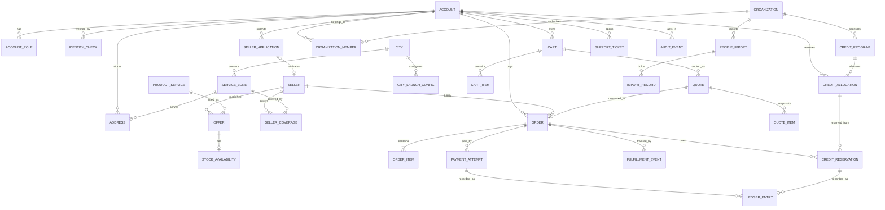

# مدل دامنه و ERD حنا — پیش‌نویس ۰.۱

**مرجع:** [معماری نسخه کامل](HANA-FULL-PRODUCT-NATIONAL-ARCHITECTURE-v1.0.md)  
**وضعیت:** پیشنهادی؛ مدل مالی و موجودی پس از تعیین D01–D06 نهایی می‌شود. این سند نام جدول SQL یا migration نهایی نیست.

## قواعد پایه
- هویت حساب، احراز هویت، صلاحیت فروشندگی، سازمان، وضعیت حمایتی و نقش دسترسی مفاهیم مستقل‌اند.
- فروشنده و سازمان با `account_id` یا `representative_id` مرتبط‌اند اما مالکیت مستقل دارند.
- خرید حقوقی ویژگی سفارش و گیرنده فاکتور است، نه ورود خریدار به پرتال سازمان.
- موجودی و قیمت در سطح **پیشنهاد قابل عرضه یک فروشنده** ثبت می‌شود؛ کاتالوگ مرجع با پیشنهاد فروشنده متفاوت است.
- سفارش و مبلغ در زمان ثبت snapshot می‌شوند؛ تغییر قیمت بعدی سفارش قبلی را تغییر نمی‌دهد.
- پول در ریال صحیح؛ تاریخ‌ها UTC؛ نمایش زمان و تومان در کلاینت.
- `city_id` و `service_zone_id` زمینه خدمت‌رسانی بر اساس نشانی **تحویل** هستند، نه صرفاً محل سکونت حساب.
- اطلاعات هویتی حساس با شناسه داخلی ارجاع داده شود؛ شماره ملی و تلفن نباید کلید عمومی URL یا گزارش باشند.

## ERD مفهومی هسته

در نمودار، `QUOTE → ORDER` و `SELLER_APPLICATION → SELLER` به معنی رابطه منطقی هستند؛ cardinality و امکان چندفروشنده‌ای تا تصمیم D01 در migration تثبیت نمی‌شود.

## مرز تراکنش‌ها و constraints

| موضوع | قید الزامی |
|---|---|
| Account | شناسه داخلی immutable، حذف/ناشناس‌سازی فقط طبق سیاست مصوب |
| Seller activation | دسترسی پنل فقط پس از تصمیم نهایی و حساب فعال |
| Organization scope | `organization_id` بر داده و authorization در هر query و عمل حساس |
| Offer & Inventory | موجودی منفی و رزرو تکراری ممنوع؛ کالای ناموجود از خرید قطعی حذف/نیازمند تصمیم |
| Quote | `quote_id`، version، `expires_at` و snapshot هزینه ارسال/اقلام |
| Order | state transition مجاز و immutable monetary snapshot؛ `request_id` یکتا |
| Payment | `attempt_id` و reference PSP با unique index؛ webhook تکراری بدون تکرار ledger |
| Ledger | رکورد افزایشی immutable، اصلاح با entry جبرانی؛ کنترل جمع بدهکار/بستانکار |
| Credit | reserve/consume/release idempotent، مانده منفی ممنوع، کاربرد شخصی/حقوقی معتبر |
| Import | batch و record hash/unique scope، گزارش خطای ردیف و عدم اعتبار مضاعف |
| City | تغییر وضعیت یک شهر نباید پیگیری سفارش قدیمی یا شهرهای دیگر را قطع کند |

## مواردی که قبل از SQL قطعی نیاز به تصمیم دارند

D01 مدل چندفروشنده‌ای سفارش و سفارش فرزند؛ D02 ظرفیت خدمت، هزینه ارسال و روش تحویل؛ D03 پرداخت در محل و مرجوعی؛ D04 مالیات/فاکتور؛ D05 ledger و منبع بودجه؛ D06 سیاست تخصیص سازمانی. بدون این تصمیم‌ها migration مربوط به پول و سفارش production-ready اعلام نشود.
