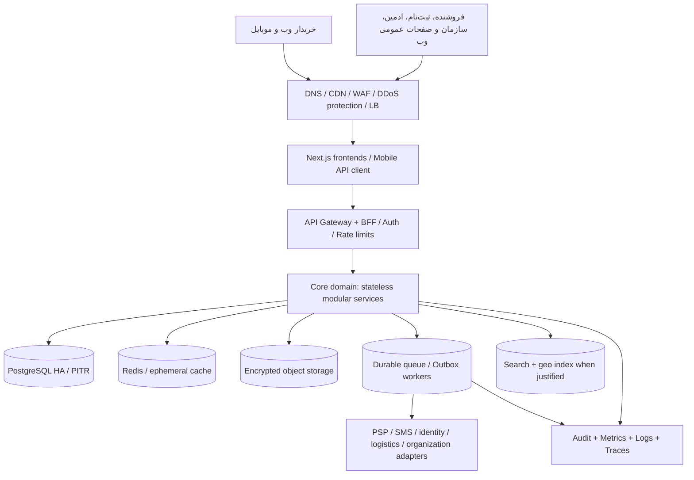

# سند مرجع معماری و تحویل نسخه کامل حنا — V1.0

**تاریخ:** ۲۰۲۶-۰۹-۱۹ | **وضعیت:** خط مبنای فنیِ پیشنهادی برای تصویب (Architecture Baseline) | **هدف انتشار:** نسخه کاملِ عملیاتی در شهر اول، سپس توسعه شهر به شهر.  
**دامنه:** همه تجربه‌های مصوب فیگما + سرویس‌های عملیاتی ضروری که برای کارکرد واقعی آن‌ها لازم‌اند.  
**قانون این سند:** «فازبندی ساخت» مجاز است؛ «انتشار نسخه ناقص به نام حنای کامل» مجاز نیست. فصل ۱۳ ملاک آمادگی انتشار است.

> «نسخه نهایی» در این سند به معنی هدف محصول و معماریِ جامع است، نه تأیید قطعی مقررات، مجوزهای مالی، قرارداد تأمین‌کنندگان یا سیاست‌های تجاریِ هنوز تصویب‌نشده. تصمیم‌های تجاری و حقوقی باز در فصل ۱۴ **مانع انتشار** هستند؛ نباید با حدس مهندسی جایگزین شوند.

## ۱. تعریف دقیق محصول نهایی

حنا یک بستر مشترک برای **بازارگاه کالا و خدمت، مقایسه فروشندگان برای سبد، خرید، سفارش و تحویل، ثبت‌نام و عملیات فروشندگان، طرح/اعتبار، همکاری سازمانی، عملیات مدیریت و پشتیبانی** است. همه بخش‌ها باید پیش از انتشار عمومی شهر اول، طبق قراردادهای یکپارچه، واقعاً کار کنند.

| کانال | امکاناتی که برای انتشار شهر اول باید قابل استفاده باشند |
|---|---|
| اپ موبایل خریدار | ورود و تکمیل حساب، کالا/خدمت، جست‌وجو، سبد، مقایسه، انتخاب فروشنده، بازبینی، checkout، پرداخت مجاز، خرید حقوقی/فاکتور در صورت فعال‌بودن، سفارش/پیگیری، نشانی، اعتبار/طرح، مشارکت اجتماعی طبق مدل مصوب، اعلان و پشتیبانی، حالت خالی/خطا |
| وب بازارگاه خریدار | تمام قابلیت‌های متناظر خریدار + صفحات عمومی، راهنما، FAQ، قوانین و حریم خصوصی نهایی |
| ثبت‌نام فروشنده وب | انتخاب حقیقی/حقوقی، احراز مجاز، کسب‌وکار، محدوده، اطلاعات تکمیلی، بازبینی، ارسال، پیگیری، درخواست اصلاح، بررسی و فعال‌سازی پس از تأیید |
| پنل فروشنده وب | داشبورد، کالا/خدمت/تصویر، موجودی/دسترس‌پذیری، قیمت، سفارش و اقدام مجاز، محدوده و روش ارائه، طرح، تسویه و تراکنش، گزارش، اعلان، اطلاعات کسب‌وکار و پشتیبانی |
| پنل ادمین وب | کاربران/نقش، فروشندگان/درخواست، کاتالوگ و محتوا، دسته‌بندی، سفارش و رسیدگی، اعتبار/طرح، سازمان/منبع داده، لجستیک، مالی، پشتیبانی، اعلان، گزارش و audit |
| پرتال سازمان وب | پروفایل، طرح، ایجاد طرح، مشمول و import، API/منبع داده، تخصیص، نتیجه، مصرف، گزارش، اعلان، پشتیبانی، تنظیمات و مجوزها |

**اپ موبایل صرفاً برای مصرف‌کننده است.** پنل فروشنده، ثبت‌نام فروشنده، ادمین و سازمان صرفاً وب‌اند. خرید حقوقی در اپ/وب خریدار، مستقل از پرتال سازمان است. صفحات `MOBILE / SELLER APP` و `MOBILE / SELLER REGISTRATION` در فیگما برای خروجی فعلی توسعه نیستند. `APP / 01–20` مرجع مسیر خریدار است؛ فریم‌های اضافی `mobile-*` تا تصویب مالک طراحی مرجع نیستند.

### تعریف «تمام فیچرها کار می‌کنند»

- دکمه صرفاً ماکت/Prototype نیست؛ رفتار، API، مجوز، خطا، loading، حالت خالی و ثبت نتیجه دارد.
- همه ورودی‌ها validation، محدودیت، feedback و مسیر بازیابی دارند.
- تراکنش واقعی مالی/اعتباری با تأمین‌کننده و قواعد **تصویب‌شده** اجرا می‌شود؛ sandbox، داده ساختگی و placeholder در محیط تولیدِ همان فیچر پذیرفته نیست.
- همه پنل‌ها همان موجودیت سفارش، حساب، فروشنده، طرح، تخصیص و وضعیت را می‌بینند؛ تناقض داده بین صفحات قابل قبول نیست.
- اگر یک قابلیت به مجوز یا ارائه‌دهنده بیرونی وابسته است، پیش از انتشار باید اتصال عملیاتی یا جایگزین رسمیِ مورد قبول محصول تعریف شود؛ مخفی‌کردن قابلیتِ تعهدشده به مشتری راه‌حل «نسخه کامل» نیست.

## ۲. معماری نهایی هدف، قابل رشد شهر به شهر



**الگوی تحویل:** یک هسته دامنه‌ای **modular monolith** در چند replica بدون state محلی، همراه workerهای جدا برای رخداد/یکپارچگی و frontendهای قابل استقرار. «ماژولار» به معنی نبود مرز نیست: ماژول‌ها schema/ownership، contract، transaction و تست مستقل دارند. جداکردن payment/credit/integration به deployable مستقل فقط هنگامی که نیاز امنیتی، مالکیت تیمی یا فشار عملیاتی اثبات شود، بدون تغییر قرارداد عمومی انجام می‌شود. **ریزش به ده‌ها microservice در روز اول شرط مقیاس ملی نیست.**

**پیش‌نیاز عملیاتی انتشار:** توزیع replica میان failure domainهای مستقلِ فراهم‌شده توسط میزبان، پایگاه داده با failover آزمایش‌شده، backup و PITR، object storage با نسخه‌بندی/backup، queue پایدار و انباشت قابل کنترل، CDN/WAF، telemetry و runbook. انتخاب دیتاسنتر/ابر باید با الزامات محل داده، مجوز، وابستگی‌ها و توان تیم سازگار باشد.

## ۳. فناوری و ساختار کد

**پشته پیشنهادی و قابل تثبیت در ADR فناوری:** TypeScript؛ وب Next.js؛ اپ خریدار React Native/Expo؛ Backend NestJS؛ PostgreSQL؛ Redis برای cache/coordination کوتاه‌عمر؛ object storage؛ message broker پایدار؛ OpenTelemetry؛ OpenAPI و CI/CD. استفاده از موتور جست‌وجوی مجزا به اندازه داده، query و نیاز geo وابسته است؛ در شروع جست‌وجوی PostgreSQL با index سنجیده شود و مرز `Search` از ابتدا مستقل باشد. Elasticsearch/OpenSearch گزینه است نه پیش‌فرض اجباری. زیرساخت declarative، migration نسخه‌دار و secret manager اجباری؛ Kubernetes اختیاری و تابع قابلیت عملیات.

```text
apps/
  web-marketplace/       # خرید + صفحات عمومی
  web-seller/            # پنل فروشنده
  web-seller-registration/
  web-admin/
  web-organization/
  mobile-consumer/
  api/                   # ماژول‌های مشترک دامنه
  workers/               # outbox, notifications, sync, reconciliation
packages/
  api-contracts/
  ui-web/
  design-tokens/
  shared-types/
  validation/
infra/
  environments/
  monitoring/
  disaster-recovery/
docs/
  architecture/
  adr/
  product-rules/
  api/
  runbooks/
  testing/
```

فایل‌ساختار هدف است؛ لزوماً به معنی ۸ سرور، ۸ پایگاه داده یا ۸ استقرار مستقل نیست. همه ظاهرها یک منبع قرارداد API، tokenهای طراحی و مدل مجوز مشترک دارند.

## ۴. مالکیت داده و مرزهای دامنه

| مرز | داده مالک و مسئولیت |
|---|---|
| Identity | Account، احراز هویت، session، تماس، نماینده حقوقی |
| Access | role، tenant membership، permission، actor/action/resource |
| Geography & Coverage | استان، شهر، منطقه، نقطه/نشانی، service zone، شهر فعال، پوشش فروشنده |
| Seller Onboarding | درخواست حقیقی/حقوقی، مدارک، بررسی، تکمیل، تأیید نهایی |
| Catalog/CMS | کالا/خدمت، دسته، تصویر، attribute، moderation، محتوای عمومی |
| Inventory/Offer | stock، availability، قیمت نسخه‌دار، محدوده و تحویل، ظرفیت خدمت در صورت مدل مصوب |
| Cart & Quote | سبد مرجع، تطبیق پیشنهاد فروشنده، قیمت/کامل‌بودن/فاصله، quote دارای انقضا |
| Order & Fulfillment | سفارش، snapshot اقلام و فروشنده/شهر، status، shipment، incident و refund request |
| Payment & Ledger | payment attempt، gateway reference، double-entry ledger، reconciliation |
| Credit & Programs | plan، eligibility مصوب، allocation، reservation، consumption، release/expiry |
| Organization | org، plan ownership، people import، identity matching، distribution و usage scope |
| Support/Notifications | tickets، پیام، الگو، delivery status، پیوست مجاز |
| Reporting/Audit | projection تحلیلی جدا، رخداد ممیزی تغییرات حساس، export محدود |
| Integration | adapterهای PSP/SMS/identity/logistics/partner و ورود/خروجی امن |

مرزهای حساب، فروشنده، سازمان و شهر را یکی نکنید. تغییر فروشندگی هیچ‌وقت احراز هویت یا وضعیت حمایتی را خودکار تأیید/رد نمی‌کند. دسترسی پرتال سازمان با `organization_id` و مجوزهای سطح object محدود است؛ حساب خریدار حقوقی یک tenant سازمانی ایجاد نمی‌کند.

## ۵. جغرافیا و توسعه شهر به شهر — بخش محوری معماری

**یک پلتفرم کشوری با تنظیمات خدمت‌رسانی محلی**؛ نه کپی کامل سامانه و DB برای هر شهر از روز اول. اطلاعات اصلی حساب و سفارش کشوری و دارای city/serviceZone context هستند. گزارش شهری، عملیات لجستیک و activation جداگانه است.

موجودیت‌های جغرافیایی:
`Province`, `City`, `District`, `ServiceZone`, `Address`, `SellerCoverage`, `DeliveryCapability`, `CityLaunchConfig`.

`CityLaunchConfig` نمونه فیلدها:
`cityId, lifecycle(DRAFT|INTERNAL|READY|LIVE|PAUSED), serviceZones, allowedFulfillmentModes, enabledPaymentMethods, enabledProgramIds, providerAvailability, supportCoverage, deliveryPolicyVersion, launchAt, pausedReason`. مقادیر باید تغییرپذیر و دارای audit و تاریخ اثر باشند.

**قواعد ضروری:**
1. شهر ثبت‌نام/نشانی خریدار را از «شهر خدمت‌رسانی سفارش» متمایز کنید. خریدار ممکن است در شهر A زندگی کند و سفارش را برای نشانی در شهر B ثبت کند.
2. مقایسه فروشندگان فقط از محدوده واقعی پوشش نشانی تحویل، ساعات، نوع کالا/خدمت، موجودی و قابلیت لجستیکی نتیجه دهد؛ نمایش قیمت فروشنده خارج از پوشش به‌عنوان پیشنهاد قابل پرداخت ممنوع.
3. قیمت و موجودی بر حسب فروشنده/عرضه ثبت می‌شود، نه پیش‌فرض برای کل شهر. نرخ ارسال از quote ثبت‌شده و روش مجاز محاسبه می‌شود.
4. `order.city_id`, `service_zone_id`, `seller_id`, `quote_version`, `policy_version` در ثبت سفارش snapshot می‌شوند تا تغییر تنظیمات شهری سفارش گذشته را عوض نکند.
5. طرح حمایتی می‌تواند شهر/سازمان/گروه هدف مجاز داشته باشد؛ تخصیص از صرف سکونت یا فعال‌شدن شهر **استنباط نشود**.
6. اجرای شهر بعدی از طریق onboarding فروشنده، پوشش، داده محصول، پرداخت/ارسال، پشتیبانی، آماده‌سازی گزارش و فعال‌سازی کنترل‌شده انجام شود؛ نه fork برنامه یا deploy جدید برای هر شهر.
7. امکان توقف checkout شهر بدون توقف پیگیری سفارش‌های پیشین یا کارکرد سایر شهرها فراهم باشد. تغییرات سراسری باید قابلیت اجرای تدریجی و rollback در سطح شهر داشته باشند.

**مرز لجستیک:** طبق [ADR-004](../adr/ADR-004-HANA-LOGISTICS-INDEPENDENT-INTEGRATION.md)، لجستیک حنا یک کسب‌وکار/سامانه عملیاتی مستقل و متصل از طریق API است؛ بازارگاه مالک سفارش و لجستیک مالک مأموریت حمل است. طبق [ADR-005](../adr/ADR-005-PICKUP-CUSTOMER-DELIVERY-ASSIGNMENT-LOGISTICS.md)، دریافت حضوریِ قابل ارائه به انتخاب مشتری است و در حالت ارسال، لجستیک حنا تعیین می‌کند مجری فروشنده باشد یا شبکه لجستیک؛ این انتخاب اجرایی را مشتری انجام نمی‌دهد. طبق [ADR-006](../adr/ADR-006-LOGISTICS-DELIVERY-FEE-SPLIT.md)، لجستیک مرجع تعیین مبلغ کل ارسال است؛ در حالت معمول سهم خریدار و فروشنده از آن نصف‌نصف است. طبق [ADR-007](../adr/ADR-007-SELLER-DELIVERY-SHARE-DEDUCTED-AT-SETTLEMENT.md) سهم فروشنده از تسویه او در حنا کسر می‌شود، نه از طریق پرداخت جداگانه. تعرفه‌ها، زمان کسر و استثناها هنوز نیازمند تصویب قرارداد مالی‌اند.

**در شهر اول نیز تمام قابلیت‌های مصوب فعال‌اند.** فعال‌سازی تدریجی شهرها feature flag جغرافیایی است، نه پوشاندن فیچر ناقص. اگر یک طرح یا روش پرداخت وابسته به قرارداد محلی و خارج از تعهد آن شهر باشد، دامنه ارائه صریحاً و پیش از انتشار اعلام شود؛ نه اینکه UI ظاهراً فعال ولی غیرقابل استفاده باشد.

## ۶. قراردادهای کلیدیِ تجربه خریدار

```text
Catalog & Search -> Cart
 -> Store Comparison (seller offers + coverage + stock + price snapshot)
 -> Select Seller/Offer
 -> Basket Review
 -> Checkout (consumer/legal + address + delivery + approved payment/credit)
 -> Server Price Quote
 -> Reserve stock / credit
 -> Create Order & Payment Attempt
 -> PSP / permitted payment completion
 -> Verified payment and ledger commit
 -> Seller fulfillment -> Track -> Complete / incident / return/refund
```

**قانون قطعی سفارش:** [ADR-001](../adr/ADR-001-SINGLE-SELLER-ORDER.md) تصویب می‌کند که هر سفارش و هر checkout دقیقاً یک فروشنده دارد؛ سفارش چندفروشنده‌ای پیاده نمی‌شود. خرید از فروشنده دیگر سفارش مستقل دارد. [ADR-002](../adr/ADR-002-CUSTOMER-CHOICE-PARTIAL-BASKET.md) نیز تصویب می‌کند که مشتری مختار است فروشنده با سبد کامل یا ناقص را انتخاب کند؛ اقلام ناموجود و مبلغ اقلام قابل تأمین پیش از تأیید آگاهانه و quote نهایی شفاف نمایش داده شوند. طبق [ADR-003](../adr/ADR-003-CUSTOMER-CONTROL-UNFULFILLED-CART-ITEMS.md) خود مشتری تعیین می‌کند اقلام تأمین‌نشده برای خرید بعدی در سبد باقی بمانند یا از سبد حذف شوند؛ تصمیم خودکار ممنوع است.

**قانون یکپارچگی سناریوی فعلی:** پس از انتخاب فروشنده، checkout از همان offer/quote مرجع استفاده می‌کند؛ تغییر هزینه ارسال، قیمت، موجودی یا قابلیت پرداخت نیاز به محاسبه مجدد و اطلاع واضح پیش از پرداخت دارد. تعارض فعلی فریم‌های `mobile-*` با `APP` نباید وارد پیاده‌سازی شود. برچسب «نزدیک‌ترین» از کمترین فاصله معتبر و قابل محاسبه می‌آید، نه متن ثابت.

**قرارداد Quote:** `quoteId`, `sellerId`, `deliveryAddressId`, `cityId`, `items[]`, `itemsTotalIrr`, `deliveryTotalIrr`, `buyerDeliveryShareIrr`, `sellerDeliveryShareIrr`, `deliveryQuoteId`, `deliveryTariffVersion`, `discountIrr`, `creditAppliedIrr`, `payableIrr`, `expiresAt`, `offerVersion`, `policyVersion`, `availableFulfillmentModes[]`. تمام مبالغ در ریال صحیح و با قواعد تبدیل/گردکردن تصویب‌شده؛ تومان صرفاً نمایش.

**قانون پرداخت:** طبق [ADR-009](../adr/ADR-009-NO-CASH-ON-DELIVERY.md)، پرداخت در محل/هنگام تحویل در حنا وجود ندارد. دریافت حضوری یا ارسال، تغییری در این ممنوعیت ایجاد نمی‌کند؛ انجام تحویل به پرداخت غیرحضوری یا اعتبار معتبر و تأییدشده طبق سیاست مصوب نیاز دارد.

**مالی و سفارش:** سیستم باید callback تکراری/دیررس، انقضای quote، شکست پرداخت، پرداخت نامعلوم، عدم موجودی، تغییر فروشنده، لغو، برگشت وجه و قطع PSP را بدون دوباره‌برداشت مدیریت کند. ایجاد سفارش/پرداخت/مصرف اعتبار idempotent؛ ledger افزایشی و قابل تطبیق با PSP؛ رکورد واقعی بدون حذف/ویرایش مخرب اصلاح شود. صف و outbox برای اعلان/جست‌وجو؛ به queue نباید بدون گارانتی idempotency اعتماد کرد.

**خرید حقوقی:** شرکت و نماینده، snapshot اطلاعات فاکتور، روش‌های پرداخت مصوب و وضعیت صدور واقعی. اعتبار حمایتی برای خرید حقوقی غیرقابل مصرف است؛ اعتبار شخصی صرفاً مطابق سیاست تصویب‌شده. «تأیید حسابداری طی ۲ روز» یا هر SLA مشابه فقط اگر واقعاً مصوب و قابل اجراست نمایش داده شود.

## ۷. مدل سازمان‌ها و اعتبار

**چهار گام مجزا:** ثبت فرد → تطبیق حساب → تأیید شرایط طرح → تخصیص قطعی؛ سپس رزرو هنگام سفارش → مصرف پس از تحقق شرط مالی → release یا expiry در زمان مناسب. ثبت فرد نباید مانده اعتباری ایجاد کند.

- سازمان حمایتگر: ورودی/طرح/مشمول در محدوده قرارداد، تخصیص بر اساس الگوی رسمی حنا؛ بدون امکان تغییر پنهانی الگوریتم توسط اپراتور سازمان.
- سازمان معمولی: تعیین گیرنده توسط سازمان در محدوده بودجه و مجوز ثبت‌شده؛ همچنان ledger/validation سمت هسته حنا.
- هر credit allocation دارای `fundingSource`, `programId`, `organizationId?`, `beneficiaryAccountId`, `amountIrr`, `eligibilityVersion`, `effectiveAt/expiresAt`, `auditReference` است.
- retry فایل/API سازمانی رکورد تکراری یا اعتبار مضاعف نسازد؛ staging، اعتبارسنجی، dedup، خطای سطری، batch summary و پیگیری لازم است.
- دسترسی سازمان فقط به داده مورد نیاز همان طرح است؛ تراکنش شخصی بیرون از طرح نمایش داده نشود.
- قواعد دقیق بودجه، حسابداری، جبران، الگوی تخصیص، منبع وجوه و expiry در مستند سیاست مصوب مستقل نگهداری شوند و تغییر نسخه داشته باشند.

## ۸. هویت، امنیت و اطلاعات حساس

Auth مرکزی، session قابل ابطال و MFA برای نقش حساس؛ هر درخواست با ترکیب `actor + action + resource + tenant + current state` ارزیابی شود. OTP ضد abuse، rate limit بر حسب IP/حساب/رویداد، جلوگیری از enumeration، least privilege، مدیریت secrets، TLS، encryption at rest، دسترسی موقت فایل و کنترل malware روی upload اجرا شود. اسناد هویتی، وضعیت حمایتی، اطلاعات مشمول و پرونده فروشنده دسترسی عملیاتی تفکیک‌شده و audit داشته باشند.

هویت رسمی ≠ تأیید فروشنده ≠ واجدشرایط‌بودن اعتبار. ادمین هم دسترسی نامحدود بی‌دلیل ندارد؛ عملیات مالی و تغییر مجوز حساس به تأیید دوم/چهارچشمی بر حسب ریسک مصوب متصل شود. گزارش تولید هرگز اطلاعات حساس را داخل exception/log/analytics خام منتشر نکند. سیاست نگهداری/حذف، اقامت داده، دسترسی نهادهای همکار، قرارداد PSP، مالیات/فاکتور و مجوزها باید توسط مسئولان ذی‌صلاح بررسی و تصویب شوند؛ سند ادعای تحقق خودکار انطباق ندارد.

مراجع کنترل: OWASP ASVS 5.0، OWASP API Security Top 10 2023، NIST SP 800-207؛ بازبینی تهدید (threat modeling) برای پرداخت/اعتبار/اطلاعات هویتی و سازمانی قبل از شهر اول.

## ۹. پایداری، ظرفیت و عملیات کشوری

**پیش از نخستین شهر:** DNS/CDN/WAF، چند replica مستقل، zero-downtime deploy، PostgreSQL HA با backup و point-in-time recovery، استقرار پشتیبان مطابق بودجه/SLO مصوب، queue replay + DLQ، snapshot و storage ایمن، monitoring/alert، فصل‌بندی محیط dev/stage/prod و restore drill.

**SLO پیشنهادی برای تصویب:** دسترس‌پذیری مسیر خرید 99.9% ماهانه، p95 داخلی API خواندن <500ms در بار توافق‌شده، RPO داده تراکنشی ≤15 دقیقه و RTO هدف ≤4 ساعت برای سایت اصلی. این ارقام تا تصویب SLA و آزمون بازیابی **تعهد واقعی نیستند**؛ پرداخت/اعتبار باید reconciliation دقیق و منع دوباره‌ثبت داشته باشند. بار هدف با شهر اول و سناریوی رشد کشوری model شود: DAU، درخواست/ثانیه، سفارش/ثانیه، نسبت جست‌وجو، اندازه سبد، حجم رسانه، import سازمانی، عملیات مالی، پیک مناسبت و اثر خرابی PSP، نه فقط تعداد ثبت‌نام.

**Degradation:** قطع پیامک یا اعلان نباید اطلاعات سفارش را پاک کند؛ قطع جست‌وجو اگر ممکن باشد به نمای محدود/مرتب‌سازی پایه تنزل کند؛ خطای PSP/اعتبار باعث وضعیت نامعلوم/معلق شفاف شود، نه «پرداخت موفق» جعلی. مشاهده و پیگیری سفارش‌های قبلی هنگام توقف checkout شهری حفظ شود. پشتیبان‌گیری بدون تست restore معیار قبولی نیست.

## ۱۰. قرارداد اجرا، محیط و چرخه انتشار

- OpenAPI نسخه‌دار، error code ماشین‌خوان، pagination، idempotency، correlation ID و سازگاری API با اپ موبایل نصب‌شده.
- Migration جلو/عقب سازگار، secret scanning، SAST/DAST متناسب، dependency scan، PR review، محیط یکپارچه نزدیک prod و تست اختلال.
- E2E برای هر مسیر واقعی با sandbox در stage و تأمین‌کنندگان production-ready؛ در production هیچ payment mock، OTP fake، موجودی جعلی یا مجوز bypass مجاز نیست.
- تست race condition روی موجودی/اعتبار، webhook تکراری، مغایرت مالی، import تکراری، غیرفعال‌شدن فروشنده، سوئیچ شهر، مجوز اشتباه tenant، backup restore و failover.
- accessibility، RTL، شمارگان فارسی، صفحه کوچک، زمان‌سنجی و unit ریال/تومان در تمام کانال‌ها کنترل شوند.

## ۱۱. ماتریس پذیرش فیچر کامل (الزام انتشار شهر اول)

| شناسه | فیچر/دامنه | حداقل آزمون پذیرش |
|---|---|---|
| F01 | ورود/حساب | ثبت/ورود/بازیابی، احراز مجاز، session و عدم دسترسی غیرمجاز |
| F02 | نشانی/جغرافیا | تعیین خدمت‌رسانی بر اساس **نشانی تحویل** و شهر فعال، توقف شهر بدون قطع سفارش‌های قبل |
| F03 | کاتالوگ کالا/خدمت | دسته، جست‌وجو، تصاویر، انتشار، وضعیت موجودی/دسترس‌پذیری |
| F04 | سبد | چند قلم، مقدار، حذف، قیمت مرجع و سبد پایدار؛ تعیین تکلیف اقلام تأمین‌نشده با انتخاب مشتری طبق ADR-003 |
| F05 | مقایسه | قیمت اقلام قابل تأمین، میزان کامل‌بودن سبد، فاصله صحیح، موجودی، ارسال، امکان انتخاب فروشنده با سبد ناقص و تأیید اقلام حذف‌شونده پیش از سفارش |
| F06 | quote/Checkout | قیمت و ارسال هماهنگ، انقضا و اعلام تغییر قبل پرداخت؛ مبلغ کل لجستیک و سهم خریدار/فروشنده جدا و قابل تطبیق طبق ADR-006 |
| F07 | خرید شخصی | سفارش end-to-end واقعی با پرداخت مجاز و پیگیری |
| F08 | خرید حقوقی | اطلاعات شرکت، روش مجاز، ممنوعیت اعتبار حمایتی، فاکتور واقعی طبق سیاست |
| F09 | سفارش/لجستیک | تأیید فروشنده، آماده‌سازی، تحویل یا ارائه خدمت، مشکل، لغو/مرجوعی طبق سیاست |
| F10 | پرداخت | فقط روش‌های غیرحضوریِ مصوب؛ بدون COD، success/failure/unknown، webhook تکراری، استعلام و reconciliation طبق ADR-009 |
| F11 | اعتبارها | تخصیص، نمایش، رزرو، مصرف، آزادسازی/انقضا، جلوگیری از اضافه‌مصرف |
| F12 | مشارکت اجتماعی | تنها فرآیند و گزارش مصوب؛ بدون آمار یا تعهد ساختگی |
| F13 | ثبت‌نام فروشنده | حقیقی/حقوقی، مدارک، بررسی، نیازمند اصلاح، شماره پیگیری، gate فعال‌سازی |
| F14 | عملیات فروشنده | کالا/خدمت، stock، قیمت، سفارش و منطقه، گزارش، تسویه و پشتیبانی |
| F15 | ادمین | همان داده معتبر، ثبت تصمیم با دلیل/audit، مدیریت محتوا/دسترسی/سازمان و رسیدگی |
| F16 | سازمان | طرح، افراد، import/API، تطبیق، تخصیص مبتنی بر مدل، مصرف و گزارش scoped |
| F17 | مالی/تسویه | ledger، مبالغ قابل تسویه، کسر یک‌باره و شفاف سهم ارسال فروشنده از تسویه طبق ADR-007، قرارداد مصوب، بازگشت وجه و تطبیق |
| F18 | پشتیبانی/اعلان | تیکت خریدار/فروشنده/سازمان، تغییر وضعیت، پیام و عدم نمایش یادداشت داخلی |
| F19 | محتوای عمومی | FAQ، تماس واقعی، شرایط/حریم خصوصی حقوقی مصوب، لینک‌ها |
| F20 | عملیات و امنیت | RBAC/ABAC، restore drill، load test، alerts، incident، داشبورد و audit |
| F21 | سازگاری کانال‌ها | وب/موبایل/ادمین/فروشنده وضعیت یک سفارش و یک تخصیص را یکسان نشان می‌دهند |
| F22 | رشد شهر | افزودن شهر دوم با config/coverage/onboarding، بدون branch مستقل یا مهاجرت مخرب |

**هیچ F01–F22 نباید با «بعداً می‌زنیم» بسته شود.** هر مورد باید صاحب، سناریو، تست و سند شواهد پذیرش داشته باشد. فقط موارد خارج از دامنه قراردادی روشن یک شهر می‌توانند در همان شهر غیرفعال شوند؛ دامنه باید به کاربران و تیم عملیات صادقانه اعلام شده باشد.

## ۱۲. برنامه ساخت تا نسخه کامل (انتشار فقط پس از تکمیل)

1. **طراحی و تصویب قراردادها:** تصمیم‌های فصل ۱۴، event flow، ERD، OpenAPI، نقش‌ها، مدل پرداخت و اعتبار، سیاست شهر/فروشنده؛ تبدیل Figma به screen inventory.
2. **Foundation مشترک:** repository، design system، auth، authorization، geo، CI/CD، DB، migrations، logs/metrics/trace و مرحله‌بندی env.
3. **توسعه موازی ماژول‌ها:** خریدار وب/موبایل، پنل فروشنده و onboarding، ادمین، سازمان، پشتیبانی و CMS طبق contract مشترک.
4. **یکپارچه‌سازی سرتاسری:** PSP/هویت/لجستیک/پیامک/سازمان، اعتبار/ledger، فاکتور، چندکانالی، reconciler و error recovery.
5. **تست پذیرش نسخه کامل:** ماتریس فصل ۱۱، security review، فشار، HA/DR، آموزش عملیات/پشتیبانی، قراردادها و محتوای نهایی.
6. **انتشار شهر اول:** کامل و تحت بار واقعیِ کنترل‌شده؛ پس از تثبیت، رشد شهر به شهر با playbook فصل ۱۳.

«ساخت موازی» و «فاز داخلی» مجازند؛ **MVP عمومی با قابلیت‌های نمایشی مقصد این پروژه نیست**.

## ۱۳. دستورعمل اجرایی توسعه هر شهر (City Rollout Playbook)

| گیت | معیار ورود به شهر جدید |
|---|---|
| G0 — تصویب محدوده | شهر/zone، سیاست قیمت/ارسال/پرداخت/حمایت و مالک عملیات مشخص |
| G1 — فروشنده و عرضه | فروشندگان تأییدشده، اقلام/خدمات، موجودی و ساعات واقعی، محدوده پوشش ثبت‌شده |
| G2 — تأمین‌کنندگان | پرداخت، هویت، پیامک، لجستیک/خدمت، سازمان محلی در صورت تعهد؛ آزمون قرارداد |
| G3 — حقوقی/مالی | قرارداد، مالیات/فاکتور، تسویه، برگشت وجه، مسئولیت‌ها و محتوا تأیید |
| G4 — تست سرتاسری شهری | سفارش واقعی آزمون‌شده، خطا، موجودی، تأخیر، بازگشت وجه، sync و scope شهر |
| G5 — ظرفیت/پشتیبانی | load بر اساس تقاضای شهر، شیفت پشتیبانی، alerts، runbooks، incident owner |
| G6 — انتشار کنترل‌شده | `DRAFT -> INTERNAL -> READY -> LIVE`؛ بازبینی گزارش، مانیتورینگ و rollback به `PAUSED` |
| G7 — تثبیت | معیارهای کیفیت سفارش، پرداخت، تحویل، تیکت، latency، reconciliation و شکایات در محدوده مصوب |

گسترش **کاربران و شهرها** تدریجی است؛ **ویژگی‌های وعده‌داده‌شده سامانه در شهر اول** قبل از انتشار کامل‌اند. پلتفرم باید افزودن شهر با تنظیمات و onboarding را پشتیبانی کند؛ هر مرحله رشد ظرفیت با داده واقعی اجرا شود.

## ۱۴. تصمیم‌های مانع تصویب/انتشار — نباید حدس زده شوند

| کد | تصمیم لازم | اثر |
|---|---|---|
| D01 — تصویب‌شده | هر سفارش دقیقاً یک فروشنده دارد؛ خرید از فروشندگان متفاوت سفارش‌های مستقل می‌سازد. [ADR-001](../adr/ADR-001-SINGLE-SELLER-ORDER.md) | Cart/Order/Payment/Fulfillment |
| D02 — بخشی تصویب‌شده | انتخاب فروشنده با سبد کامل یا ناقص و تعیین تکلیف اقلام تأمین‌نشده به اختیار مشتری است؛ [ADR-002](../adr/ADR-002-CUSTOMER-CHOICE-PARTIAL-BASKET.md) و [ADR-003](../adr/ADR-003-CUSTOMER-CONTROL-UNFULFILLED-CART-ITEMS.md). روش دقیق رتبه‌بندی، محدوده، تعرفه/استثناهای هزینه ارسال و ظرفیت خدمت باز است؛ مرجع قیمت کل لجستیک و تقسیم معمول ۵۰/۵۰ طبق [ADR-006](../adr/ADR-006-LOGISTICS-DELIVERY-FEE-SPLIT.md) تصویب شده است؛ اصل استقلال لجستیک در [ADR-004](../adr/ADR-004-HANA-LOGISTICS-INDEPENDENT-INTEGRATION.md) و انتخاب مراجعه حضوری با مشتری/تعیین مجری ارسال با لجستیک در [ADR-005](../adr/ADR-005-PICKUP-CUSTOMER-DELIVERY-ASSIGNMENT-LOGISTICS.md) تصویب شده است | Geo/Quote/UX |
| D03 — بخشی تصویب‌شده | سهم ارسال فروشنده از تسویه داخل حنا کسر می‌شود ([ADR-007](../adr/ADR-007-SELLER-DELIVERY-SHARE-DEDUCTED-AT-SETTLEMENT.md))؛ پرداخت در محل وجود ندارد ([ADR-009](../adr/ADR-009-NO-CASH-ON-DELIVERY.md)). فاصله تسویه یک‌روزه و چرخه کوتاه سفارش سوپرمارکتی طبق [ADR-008](../adr/ADR-008-GROCERY-ONE-DAY-FULFILLMENT-SETTLEMENT-PENDING.md) ثبت شده، ولی مبدأ دقیق آن و سیاست لغو/مرجوعی/جبران باز است | Finance/Operations |
| D04 | شرایط خرید حقوقی، مرجع فاکتور رسمی و قواعد واقعی مالیات | Checkout/Accounting |
| D05 | مدل اعتبارات: مالک پول، source، eligibility، حد، split tender، expiry | Credit/Ledger |
| D06 | نسخه مصوب الگوی تخصیص حنا و حدود اختیار سازمان‌ها | Organization |
| D07 | قرارداد و SLA واقعی PSP، OTP، هویت، لجستیک و همکار سازمانی | Integration/SLO |
| D08 | متن حقوقی، سیاست حفظ/حذف و اقامت داده، مجوزهای لازم | Security/Launch |
| D09 | شهر اول، حجم سفارش، تعداد فروشنده، پوشش، هزینه، پشتیبانی و SLO | Capacity/Rollout |
| D10 | تعیین مرجع یکتای طراحی اپ خریدار و اختلافات وب/موبایل در پرداخت و ارسال | UI/API parity |

**D01 طبق ADR-001 و اصل انتخاب سبد ناقص در D02 طبق ADR-002 تصویب شده‌اند. پیش از کدنویسی می‌توان اسکلت، UI، mock در dev/stage و قراردادهای اولیه را ساخت؛ اما پیش از freeze دامنه و انتشار عمومی شهر اول، باقی موارد D02 و D03–D10 باید به تصمیم امضاشده/ADR با مالک و تاریخ تبدیل شوند.** این سند معماری را کامل می‌کند، ولی سیاست‌های کسب‌وکار را بدون مالک جعل نمی‌کند.

## ۱۵. منابع کنترل مرجع

- OWASP ASVS 5.0 (نسخه پایدار): https://github.com/OWASP/ASVS
- OWASP API Security Top 10 2023: https://api-security.owasp.org/editions/2023/en/0x11-t10/
- NIST SP 800-207 — Zero Trust Architecture: https://csrc.nist.gov/pubs/sp/800/207/final
- PostgreSQL backup/PITR: https://www.postgresql.org/docs/current/continuous-archiving.html
- OpenTelemetry: https://opentelemetry.io/docs/

**نتیجه الزام‌آور طرح:** حنای کامل، با همه پنل‌ها و جریان‌های مالی/اعتباریِ مصوب، ابتدا در شهر اول عملیاتی و آزموده می‌شود؛ بعد «شهر» به‌عنوان پیکربندی/محدوده عملیات گسترش می‌یابد، نه «فیچرها» به‌عنوان بدهی انتشار آینده.
