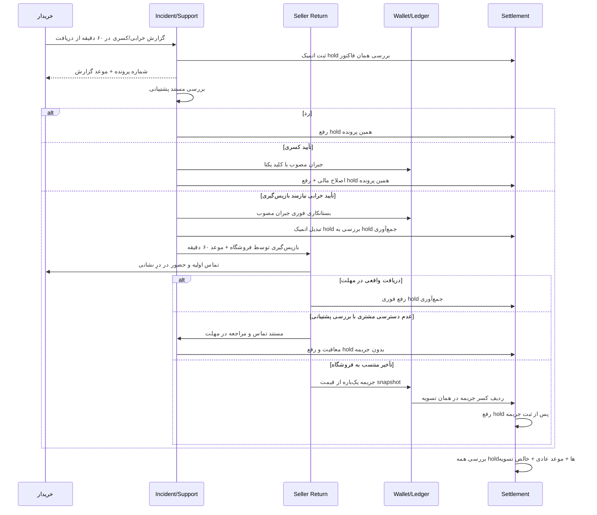

# طراحی فنی جریان کسری/خرابی، بازپرداخت و تسویه فروشنده — ۰.۱

**وضعیت:** طرح پیاده‌سازی برای قواعد **مصوب** ADR-008، ADR-013 تا ADR-017 و ADR-019 تا ADR-038؛ نام جدول/مسیر/رویداد در این سند **پیشنهادی فنی** است، نه تصمیم تجاری تازه یا ادعای پیاده‌سازی موجود.  
**دامنه:** سفارش تک‌فروشنده‌ای؛ ارسال و دریافت حضوری؛ مشتری، پشتیبانی حنا، فروشگاه، کیف پول و تسویه.  
**مرجع API:** [قرارداد جزئی‌تر جریان](../api/HANA-INCIDENT-SETTLEMENT-API-CONTRACT-v0.1.md) · **مرجع آزمون:** [ماتریس آزمون](../testing/HANA-INCIDENT-SETTLEMENT-ACCEPTANCE-MATRIX-v0.1.md).

## ۱. ناوردایی‌ها

1. ساعت گزارش هر دو نوع `MISSING_ITEM` و `DAMAGED_ITEM` از `customerReceivedAt` واقعی شروع می‌شود؛ گزارش اولیه تا **دقیقاً** ۶۰ دقیقه بعد معتبر است (ADR-030/031). `courierHandoffAt`، `readyAt` و `supportApprovedAt` مبدأ نیستند.
2. هر گزارش به‌موقع تا تصمیم مستند پشتیبانی، **فقط همان فاکتور** را از پرداخت تسویه بازمی‌دارد (ADR-032)؛ پرونده دیگر همان فاکتور نیز می‌تواند hold مستقل داشته باشد.
3. تأیید خرابی با بازپس‌گیری، hold پشتیبانی را **اتمیک** به hold SLA فروشگاه تبدیل می‌کند؛ پنجره بدون hold میان این دو وجود ندارد (ADR-033).
4. پول تأییدشده مشتری در همان لحظه تأیید پشتیبانی مطابق منشأ پرداخت اعتبار داده می‌شود؛ دریافت کالا، تسویه و جریمه مانع آن نیستند (ADR-022/024). عکس به‌تنهایی تأیید/بازپرداخت نیست.
5. تماس اولیه فروشگاه و مراجعه واقعی به درِ نشانی **در ۶۰ دقیقه پس از تأیید پشتیبانی** شرط معافیت ناشی از عدم دسترسی مشتری‌اند. تماس بی‌پاسخ تنها کافی نیست؛ احراز با پشتیبانی است (ADR-035/036).
6. دریافت واقعی کالا در مهلت، hold بازپس‌گیری را همان موقع برمی‌دارد؛ فقط بازگشت به صف تسویه **معمول**، نه انتقال بانکی فوری. عدم دسترسی احرازشده هم hold را پس از تصمیم پشتیبانی، بدون جریمه و بدون ثبت دریافت، آزاد می‌کند؛ مراجعه مجدد فروشگاه برای همان پرونده اجباری نیست (ADR-034/037).
7. جریمه در تأخیرِ منتسب به فروشگاه، قیمت واقعی **قلم/واحد آسیب‌دیده در snapshot سفارش پس از تخفیف** است؛ ردیف کسر جدا و یک‌باره از تسویه همان فروشگاه؛ در عدم دسترسی احرازشده مشتری جریمه‌ای نیست (ADR-026 تا ADR-029، ADR-035).
8. فاکتور با hold فعال، وضعیت پرداخت `PAID` نگیرد؛ جریمه مشتری نباشد؛ وجه محدودِ اعتباری قابل برداشت نشود؛ هیچ retry نباید دو refund، دو جریمه یا دو پرداخت تسویه بسازد.

## ۲. مالکیت و مرزهای تراکنش

| بخش | مالک فرمان و وضعیت | مسئولیت |
|---|---|---|
| Order/Fulfillment | `Order` | دریافت واقعی مشتری، snapshot فروشنده/اقلام، جلوگیری از تداخل لغو با تحویل |
| Incident/Support | `Incident` | ثبت به‌موقع، پیوست، نتیجه پشتیبانی، تصمیم مستند عدم دسترسی |
| Seller Return | `ItemReturn` | تماس/حضور فروشگاه، دریافت فیزیکی، سررسید یک‌ساعته، وضعیت عدم دسترسی |
| Finance/Wallet | `Ledger` / `Refund` | برگشت cash و credit به منشأ صحیح؛ حسابرسی و anti-double-refund |
| Settlement | `Settlement` / `SettlementHold` | قفل فاکتور، کسرهای مجزا، آزادسازی، پرداخت و تطبیق |
| Worker/Outbox | `Outbox` | اعلان‌ها، زمان‌سنج سررسید، retry با پیام‌های تکراری |

برای صحت hold و پرداخت، Order/Incident/Settlement باید در هسته modular monolith دارای **معامله پایگاه داده مشترک یا هماهنگ‌کننده‌ای با ضمانت هم‌ارزِ بدون پنجره پرداخت** باشند. Redis lock به‌تنهایی مانع مالی نیست. outbox فقط رویدادهای پس از commit را می‌فرستد؛ وضعیت مالی قطعی به پاسخ webhook متکی نمی‌ماند.

## ۳. ماشین حالت‌های پیشنهادی

### پرونده پشتیبانی

`REPORTED → UNDER_REVIEW → APPROVED | REJECTED`

برای `DAMAGED_ITEM` تأییدشده‌ای که واقعاً باید بازپس گرفته شود، `ITEM_RETURN` ساخته شود؛ برای `MISSING_ITEM` **هیچ** مأموریت بازپس‌گیری و جریمه جمع‌آوری ساخته نشود. اگر چند گزارش درباره یک قلم/تعداد همپوشانی دارند، سیستم باید مقدار قابل جبران و مبنای قیمت را قبل از posting قطعی تطبیق دهد؛ سیاست دقیق تخصیص تخفیف سبدی هنوز باز است.

### بازپس‌گیری کالای خراب

| وضعیت پیشنهادی | معنی | اثر بر hold |
|---|---|---|
| `PENDING_CONTACT` | پشتیبانی تأیید کرده، ساعت فروشگاه شروع شده | `DAMAGED_RETURN_SLA_HOLD` فعال |
| `CONTACTED` | تماس اولیه با مشتری ثبت شده | hold فعال؛ تماس به‌تنهایی دریافت نیست |
| `ARRIVED_AT_DOOR` | حضور معتبر مأمور خود فروشگاه در نشانی | hold فعال تا دریافت یا بررسی عدم دسترسی |
| `COLLECTED_ON_TIME` | `sellerCollectedAt <= sellerReturnDueAt`؛ دریافت واقعی | همان موقع رفع hold پرونده، جریمه صفر |
| `CUSTOMER_UNAVAILABLE_REVIEW` | مراجعه در مهلت ثبت؛ عدم دسترسی ادعاشده | **hold فعال، جریمه هنوز قطعی نشود** |
| `CUSTOMER_UNAVAILABLE_VERIFIED` | پشتیبانی تماس + مراجعه در مهلت + علت منتسب به مشتری را احراز کرده | رفع hold پرونده، بدون جریمه، بدون `sellerCollectedAt`، بدون الزام مراجعه مجدد |
| `BREACH_CONFIRMED` | مهلت سپری شده و استثنای معتبر ثابت نشده | ثبت یک جریمه و ردیف کسر، سپس رفع hold |

`CUSTOMER_UNAVAILABLE_REVIEW` با `COLLECTED_ON_TIME` اشتباه نشود. اگر ادعای عدم دسترسی هنگام deadline باز است، **timer نباید به‌صورت قطعی وجه را به فروشگاه پرداخت کند یا جریمه را بی‌بررسی وصول کند**؛ نتیجه نهایی پشتیبانی یا شاخه تخلف قطعی‌کننده است.

### تسویه فاکتور

`ELIGIBLE → ON_HOLD → ELIGIBLE → PAYOUT_SUBMITTED → PAID`؛ وضعیت‌های خطا/نامعلوم payout نیز جدا از `PAID`. منشأ هر hold و آزادسازی‌اش شناسه پرونده و علت مستقل دارد؛ رفع یک hold به معنی حذف سایر holdهای فاکتور نیست. منظور `ELIGIBLE` احراز مجازبودن مالی و حضور در چرخه تسویه **پایان هر روز کاری همه فروشگاه‌ها طبق [ADR-038](../adr/ADR-038-ALL-SELLERS-SETTLED-END-OF-EACH-WORKDAY.md)** است؛ «یک روز بعد از پرداخت یا تحویل» دیگر قاعده نیست. تقویم روز کاری و ساعت دقیق cut-off هنوز باید به‌صورت policy صریح تعریف شوند، نه حدس در کد.

## ۴. سناریوی ترتیبی



### چرخه روزانه همه فروشگاه‌ها — ADR-038

`businessDate`، `settlementCycleId` و `cycleCutoffAt` کلیدهای پیشنهادی یک batch پایان روز کاری‌اند؛ مقدار cut-off باید از **تقویم کاری حنا با policy مصوب** بیاید، نه ثابت ۲۴ ساعت پس از `paidAt` یا `customerReceivedAt`. موتور batch در انتهای هر روز کاری، فاکتورهای قابل‌تسویه همه sellerها را ارزیابی می‌کند و فاکتورهای held را با دلیل جدا در خروجی حسابرسی نگه می‌دارد. محاسبه «فاکتورهای مجاز» به معنی تغییر نتیجه شکایت یا برداشت وجه مشتری نیست.

1. ابتدا شناسه یکتای `businessDate + sellerId + cycleType` یا معادل نسخه‌دار برای batch/settlement ایجاد یا بازیابی شود؛ retry اجرا، batch جدیدی با همان scope نسازد.
2. انتخاب فاکتورها، snapshot کسورات و ایجاد فرمان پرداخت باید با `settlementVersion`/قفل فاکتور در برابر ثبت incident اتمیک باشد. `WHERE activeHoldCount = 0` صرفاً روی replica یا cache برای صدور دستور بانکی کافی نیست.
3. فاکتور دارای hold از payout همان چرخه خارج می‌شود، **بدون حذف سایر فاکتورهای واجد شرایط همان فروشگاه**. پس از رفع hold فاکتور، آن فاکتور به چرخه پایان روز کاری واجد شرایط بازمی‌گردد؛ دستور میان‌روزی جدا ساخته نشود.
4. `PAYOUT_SUBMITTED`، `PAYOUT_UNKNOWN` و `PAID` تفکیک شوند؛ رسید بانکی/تطبیق واقعی برای `PAID` لازم است. اگر ارائه‌دهنده بانکی تأخیر دارد، SLA وصول واقعی پول از سیاست ساعت انجام batch جدا تعریف شود.
5. جمع اقلام مالی، سهم حمل فروشنده، جریمه مورددار، refund قبلاً منظورشده و شناسه منبع ledger مستقل و یکتا باشند؛ بدون سیاست مصوب برای کسری موجودی، خالص منفی یا بدهی خودکار ساخته نشود.

**موارد قابل پیکربندی اما هنوز تصمیم‌نگرفته:** تعطیلی پنجشنبه/تعطیلات دیگر، ساعت و منطقه زمانی پایان روز، چگونگی برچسب‌گذاری چرخه در تعطیلات، و حداقل مانده قابل پرداخت. ثبت `businessDate` و `policyVersion` امکان بازتولید محاسبات تاریخی پس از تصویب تقویم را فراهم می‌کند.

## ۵. اتمیسیته، race و idempotency

**ثبت گزارش و قفل تسویه:** در یک transaction: قفل سطر وضعیت تسویه/فاکتور، صحت مالکیت سفارش و `customerReceivedAt`، اعتبار `incidentReportedAt <= customerReceivedAt + 60m`، dedup درخواست، ایجاد incident، ایجاد hold آن و افزایش نسخه وضعیت مالی؛ commit سپس outbox اعلان. رقابت با submit پرداخت باید روی **همان سطر/نسخه** serial شود. اگر پرداخت بانکی واقعاً پیش از ثبت hold انجام شده، رفتار بازیابی/مطالبه هنوز تصمیم محصول ندارد؛ جعل hold «اثر پیش از پرداخت» ممنوع است.

**تأیید پشتیبانی:** با قفل incident/settlement، ثبت تصمیم و نتیجه مصوب؛ برای خرابی نیازمند بازپس‌گیری ساخت hold SLA قبل/همزمان با رفع hold بررسی؛ در همان transaction مالیِ معتبر، ثبت refund و بستانکاری بخش نقدی در کیف پول و بازگرداندن اعتبار به منشأ. outbox برای اعلان و درخواست عملیات بیرونی. اگر کیف پول/ledger سرویس جدا است، باید طرح atomic effect با ضمانت فوری مصوب ارائه شود؛ «بعداً worker درستش می‌کند» تحقق ADR-024 نیست.

**SLA timer:** با deadline ثابت `supportApprovedAt + 60m` و قفل سطر return اجرا شود. `sellerCollectedAt <= dueAt` (حتی دقیقاً سررسید) برنده مسیر بدون جریمه است. timestamp واردشده از موبایل یا پنل بدون تأیید سرور نمی‌تواند retroactive ساعت دریافت را دست‌کاری کند. تماس و حضور با timestamps معتبر مستقل‌اند؛ روش مدرک حضور (GPS تنها یا عکس نیز) **باز** است.

**عدم دسترسی مشتری:** ثبت تماس و حضور در مهلت، حالت `CUSTOMER_UNAVAILABLE_REVIEW` را فعال کند؛ تصمیم پشتیبانی شرط معافیت و رفع hold است. بدون تماس یا بدون حضور در درِ مشتری طی مهلت، صرف ادعا معافیت نمی‌سازد. تأیید، تکلیف مراجعه دوم را خاتمه می‌دهد اما دریافت کالا را جعل نمی‌کند.

**کسر و تسویه:** کلید یکتای دامنه برای penalty مثل `returnId + penaltyType`؛ قید یکتای `settlementId + deductionType + sourceId`؛ payout attempt با idempotency key مستقل و تطبیق بانک/PSP. جایگزینی سطر ledger ممنوع؛ اصلاح فقط رویداد جبرانی.

## ۶. دفترکل و داده حسابرسی

```text
frozenItemAmountAfterDiscountIrr = قیمت واقعی واحدهای آسیب‌دیده در snapshot سفارش
sellerLateReturnPenaltyIrr = frozenItemAmountAfterDiscountIrr (فقط در تخلف منتسب به فروشگاه)
sellerNetSettlementIrr = مبلغ قابل تسویه مطابق قرارداد مالی - کسورات مصوب منفک
```

**احتیاط:** فرمول کامل خالص، ترتیب همه کسورات، سرشکن‌کردن تخفیف‌های سبدی، موجودی ناکافی بعد از کسورات و قانون پرونده پس از payout واقعاً اجراشده هنوز نهایی نشده‌اند؛ کد نباید از مثال بالا تسویه منفی، بازپرداخت دوباره یا برداشت حساب بانکی فروشگاه استنتاج کند. پرداخت کیف پول با موجودی فروشگاه یا وصول جریمه شرطی نشود.

مدارک تماس، حضور و عکس خرابی: storage محرمانه با دسترسی کوتاه‌مدت و نقش‌محور؛ metadata/شناسه مدرک در audit؛ **انتشار نشانی، شماره تماس و عکس در response عمومی یا notification غیرمجاز**. زمان‌ها UTC/ISO8601 و ریال integer هستند.

## ۷. مشاهده‌پذیری و هشدار عملیاتی

- gauge: تعداد فاکتور `ON_HOLD` به تفکیک علت، شهر و سن hold؛ شمار پرونده در `CUSTOMER_UNAVAILABLE_REVIEW`.
- counter: گزارش‌های ردشده به‌خاطر مهلت، بازپرداخت‌های موفق/نامعلوم، جریمه‌های ثبت‌شده/معاف‌شده، callback تکراری، پرداخت متوقف‌شده توسط hold.
- alert: `sellerReturnDueAt` نزدیک، timer عقب‌مانده، کیف پول تأییدشده بدون entry معتبر، payout در وضعیت نامعلوم، hold مانده بعد از تصمیم نهایی/ثبت جریمه.
- reconciliation روزانه: hold فعال در برابر payout، کلیدهای یکتای refund/penalty، مغایرت snapshot قیمت، جبران منشأ اعتبار و cash، مدارک غایب عدم دسترسی.

## ۸. موارد باز، نه مجوز تأخیر در ساخت بخش مصوب

- نحوه حداقلی اثبات حضور در درِ مشتری، حداقل تعداد تماس و زمان انتظار.
- تخصیص تخفیف سبدی به قلم آسیب‌دیده و همپوشانی گزارش‌ها.
- تقویم روز کاری، منطقه زمانی و ساعت cut-off چرخه تسویه روزانه ADR-038؛ کسری تسویه پس از سایر کسورات، payout انجام‌شده پیش از incident، اعتراض‌های استثنایی و سیاست اختلاف زمان تحویل.
- وضعیت نهایی کالا نزد مشتری بعد از پرونده عدم دسترسی؛ ADR-037 صرفاً **مراجعه مجدد اجباری فروشگاه** را منتفی می‌کند.

**این موارد در پیاده‌سازی با feature policy مصوب/مانع انتشار مدیریت شوند، نه مقدار پیش‌فرض پنهان.**