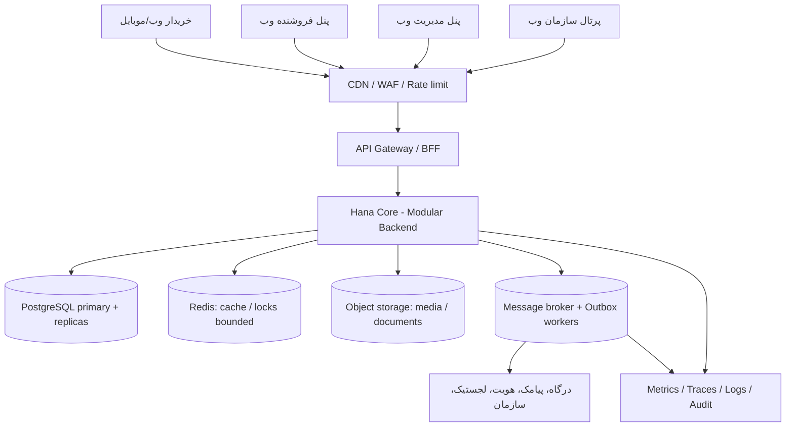

# سند فنی و معماری مرجع سامانه حنا

**نسخه:** 0.1 — پیش‌نویس قابل بررسی، نه مشخصات نهایی اجرا  
**تاریخ:** ۱۴۰۵/۰۶/۲۸ (۲۰۲۶-۰۹-۱۹)  
**مخزن:** `mahdimarzooghi4-debug/henna`  
**وضعیت:** Proposed / نیازمند تصویب مالک محصول، معماری، امنیت، عملیات و حقوقی

> هدف سند: طراحی حنا به‌عنوان بازارگاه و بستر اعتباری با قابلیت خدمت‌رسانی در مقیاس ملی؛ «مقیاس ملی» در این سند هدف مهندسی است و ادعای مجوز، وابستگی دولتی، اتصال قطعی به زیرساخت‌های ملی یا تأییدیه قانونی نیست. مفروضات و اهداف عددی باید پس از شناخت ترافیک و توافق سطح خدمت تصویب شوند.

## ۱. دامنه محصول و مرزها

حنا مجموعه‌ای از تجربه‌های متصل با یک هویت حساب کاربری و APIهای مشترک است:

| تجربه | کانال | مرز عملکردی |
|---|---|---|
| بازارگاه خریدار | وب دسکتاپ و اپ مصرف‌کننده موبایل | جست‌وجو، سبد، مقایسه، ثبت سفارش، پرداخت، پیگیری، خرید حقوقی/فاکتور |
| پنل فروشنده/ارائه‌دهنده | وب دسکتاپ | کالا/خدمت، موجودی و دسترس‌پذیری، قیمت، سفارش، تحویل، گزارش، تسویه |
| ثبت‌نام فروشنده | وب دسکتاپ | حقیقی/حقوقی، احراز هویت، مدارک، بررسی، تأیید نهایی |
| پنل مدیریت | وب دسکتاپ | کاربران، درخواست‌ها، فهرست‌ها، سفارش، محتوا، حمایت، گزارش، دسترسی و رسیدگی |
| پرتال سازمان‌ها | وب دسکتاپ | طرح، مشمول، منبع داده، تخصیص، مصرف تجمیعی و پشتیبانی |
| صفحات عمومی | وب واکنش‌گرا | معرفی، FAQ، راهنما، تماس، قوانین، حریم خصوصی |

**خارج از محدوده اپ مصرف‌کننده:** مدیریت فروشنده، ثبت‌نام فروشنده، پرتال سازمانی و ادمین. فریم‌های فروشندگی موبایل فعلی در Figma آرشیو/خارج از محدوده اجرا هستند، نه مبنای توسعه. مسیر مرجع اپ خریدار `APP / 01–20` است؛ شش فریم مستقل `mobile-*` تا تعیین تکلیف نباید مسیر دوم محصول ایجاد کنند.

**تفکیک بنیادین:** «خرید حقوقی و فاکتور رسمی» یک حالتِ سفارش خریدار است و به معنی دسترسی به پرتال سازمانی نیست. «حساب کاربری»، «احراز هویت»، «وضعیت حمایتی»، «صلاحیت فروشندگی» و «عضویت در سازمان» همگی مفاهیم جدا هستند.

## ۲. اصول معماری و تصمیم اولیه

1. ابتدا **ماژولار مونولیت** با مرزبندی دامنه، یک خط استقرار اصلی و قراردادهای روشن؛ نه ده‌ها ریزسرویس از روز اول. تفکیک به سرویس مستقل فقط با شواهدِ نیاز مقیاس، مالکیت تیمی، پایداری یا ایزولاسیون انجام شود.
2. **Backend منبع حقیقت است:** محاسبه قیمت نهایی، مجوز دسترسی، واجدشرایط‌بودن اعتبار، موجودی رزروشده، وضعیت سفارش و فاکتور هرگز از اعداد فرانت پذیرفته نشوند.
3. همه کانال‌ها از **مدل دامنه و قرارداد API مشترک** استفاده کنند؛ UI و BFFهای متناسب هر کانال مجازند.
4. رخدادها برای آثار جانبی و یکپارچگی‌ها؛ تراکنش پایگاه داده برای تغییرات حیاتیِ داخل یک مرز. سازگاری نهایی برای جست‌وجو و گزارش قابل قبول، برای **دوباره‌برداشت وجه/دوباره‌مصرف اعتبار** غیرقابل قبول است.
5. امنیت، محرمانگی، ردیابی و بازیابی از ابتدا جزء تعریف تکمیل کار باشند.
6. پذیرش فناوری، ارقام SLA/SLO و قواعد مالی مشروط به داده و تأیید رسمی است.

## ۳. نمای کلان پیشنهادی



### مرزهای دامنه در Backend

| ماژول | مسئولیت و مالک داده |
|---|---|
| Identity & Accounts | شناسه حساب، نشست، بازیابی، نوع حساب، هویت تأییدشده |
| Authorization | نقش‌ها، دامنه سازمان/فروشنده، مجوز عملیاتی، جداسازی محیط‌ها |
| Seller Onboarding | پرونده درخواست، مراحل، مدارک، نتیجه بررسی و فعال‌سازی فروشنده |
| Catalog | کالا/خدمت، دسته‌بندی، تصاویر، انتشار و وضعیت بررسی محتوا |
| Inventory & Service Availability | موجودی، رزرو، دسترس‌پذیری خدمت، ظرفیت/بازه زمانی در صورت تعریف |
| Search & Geo | فیلتر، محدوده خدمت، فروشندگان نزدیک و رتبه‌بندی شفاف |
| Cart & Comparison | سبد پیش‌فروشگاهی، پیشنهاد فروشندگان، کامل‌بودن سبد و snapshot قیمت |
| Ordering & Fulfillment | سفارش، اقلام، تحویل، تغییرات وضعیت، مسائل موجودی و بازگشت وجه |
| Payment & Financial Ledger | درخواست پرداخت، callback، تسویه‌پذیری، دفتر ثبت تغییرات مالی |
| Programs & Credits | تعریف طرح، مانده، رزرو/مصرف/آزادسازی اعتبار و محدودیت‌های ثبت‌شده |
| Organization | سازمان، طرح وابسته، مشمول، منبع داده، تخصیص و گزارش مجاز |
| Support & Notifications | تیکت، اطلاع‌رسانی، اعلان‌های عملیاتی و قالب پیام |
| CMS & Admin | محتوای عمومی، عملیات مدیریتی، audit trail و گزارش تجمیعی |
| Integration Adapters | اتصال به درگاه، استعلام مجاز، لجستیک، پیامک، APIهای سازمانی |

**مرز داده:** هر ماژول مالک جداول و API خودش است؛ دسترسی مستقیم ماژول‌ها به جداول داخلی یکدیگر ممنوع/محدود و در معماری مرور شود. در شروع ممکن است همه در یک PostgreSQL باشند؛ انحصار مالکیت داده مسیر تفکیک بعدی را باز می‌گذارد.

## ۴. کلاینت‌ها و ساختار مخزن

**انتخاب اولیه مشروط به تأیید تیم:**
- Web: `Next.js + TypeScript` برای بازارگاه، فروشنده، ثبت‌نام، ادمین، سازمان و صفحات عمومی.
- Mobile consumer: `React Native + Expo + TypeScript`، بدون صفحات مدیریت فروشنده یا سازمان.
- Backend: `TypeScript + NestJS` یا چارچوب هم‌تراز قابل پشتیبانی تیم؛ تصمیم نهایی باید با مهارت/استخدام/بار عملیاتی سنجیده شود.
- API: REST + OpenAPI نسخه‌دار؛ رویدادهای AsyncAPI در صورت نیاز؛ WebSocket فقط برای نیاز واقعی.
- فرم و UI: کامپوننت مشترک RTL، فونت فارسی مجاز، استاندارد دسترس‌پذیری، اعتبارسنجی سمت کلاینت و سرور.

```text
henna/
  apps/
    web-marketplace/
    web-seller/
    web-seller-registration/
    web-admin/
    web-organization/
    mobile-consumer/
    api/
    workers/
  packages/
    design-tokens/
    ui-web/
    api-contracts/
    domain-types/
    shared-config/
  infra/
    environments/
    observability/
  docs/
    architecture/
    api/
    adr/
    operations/
  .github/workflows/
```

این ساختار **پیشنهاد نهایی‌نشده** است، نه توصیف فایل‌های موجود. تا زمان اثبات نیاز، می‌توان چند تجربه وب را در یک Next.js با route group و کنترل دسترسی دقیق مستقر کرد؛ جداسازی ظاهری پوشه‌ها به معنی هزینه چند استقرار مستقل نیست.

## ۵. مدل مفهومی داده و ناوردایی‌ها

موجودیت‌های پایه:

`Account, IdentityVerification, RoleAssignment, SellerApplication, Seller, Organization, OrganizationMember, Product, Service, Listing, Inventory, Availability, Cart, Quote, Order, OrderItem, PaymentIntent, PaymentTransaction, LedgerEntry, CreditProgram, CreditAllocation, CreditReservation, CreditUsage, Fulfillment, SupportTicket, AuditEvent, IntegrationEvent`.

- حساب کاربری شناسه پایدار دارد؛ اطلاعات ملی/شماره تماس کلید عمومی خارجی در URL یا لاگ نیستند.
- یک فرد می‌تواند خریدار باشد و بعد درخواست فروشندگی بدهد؛ وضعیت حمایتی یک ویژگی مرتبط با حساب است، **نه مجوز یا منع فروشندگی**.
- فروشنده فقط پس از **تأیید نهایی پرونده و فعال‌سازی** دسترسی عملیاتی می‌گیرد.
- یک سازمان در محدوده داده‌های خودش و فقط با مجوز مشاهده/تغییر می‌کند؛ سازمان حمایتگر و معمولی سیاست تخصیص متفاوت دارند.
- مبالغ در واحد پایه **ریال** به صورت عدد صحیح ذخیره شوند؛ واحد نمایش «تومان» بر اساس تبدیل و گردکردن تعریف‌شده. قیمت و قواعد مالی با رقم ممیز شناور ذخیره نشوند.
- سفارش، قیمت اقلام، تخفیف، هزینه ارسال، قواعد طرح، مالیات/فاکتورِ تعریف‌شده و فروشنده را در زمان ثبت به‌صورت snapshot حفظ کند تا تغییر بعدی قیمت تاریخچه را تغییر ندهد.
- `orderId`, `paymentAttemptId`, `allocationId`, `externalReference` شناسه‌های متمایزند؛ برای منابع بیرونی unique constraint و idempotency تعریف شود.
- هر سند هویتی یا پرونده حساس باید طبقه‌بندی و دسترسی حداقلی داشته باشد.

## ۶. مسیرهای حیاتی و سازگاری تراکنشی

### ۶.۱ خرید

```text
جست‌وجو/فیلتر
 -> سبد مستقل از فروشگاه
 -> مقایسه پیشنهادها با زمان اعتبار
 -> انتخاب فروشنده + بررسی اقلامِ قابل تأمین
 -> محاسبه مجدد quote سمت سرور (قیمت/ارسال/اعتبار)
 -> رزرو موقت موجودی و در صورت انتخاب، اعتبار
 -> ایجاد Order در وضعیت PendingPayment
 -> ایجاد درخواست پرداخت با کلید تکرارناپذیر
 -> تأیید server-to-server با PSP
 -> ثبت پرداخت در Ledger و نهایی‌سازی رزروها
 -> تأیید فروشنده/آماده‌سازی/تحویل/تکمیل
```

**موارد شکست:** انقضای quote، عدم موجودی، انقضای رزرو، callback تکراری یا خارج از ترتیب، قطع ارتباط درگاه، لغو، مرجوعی و بازگشت وجه. `Idempotency-Key` برای ایجاد سفارش/پرداخت/مصرف اعتبار و unique constraint پایگاه داده لازم است؛ webhook تکراری نباید دوباره بدهکار کند. نتیجه نامعلوم پرداخت با **استعلام وضعیت و تطبیق دوره‌ای** حل شود، نه با فرض شکست یا موفقیت. کالا بدون تأیید خریدار جایگزین نشود. اقدام فروشنده باید با وضعیت فعلی سفارش مجازسنجی شود.

**یادداشت تکمیلی پس از این نسخه اولیه:** پرداخت در محل طبق [ADR-009](../adr/ADR-009-NO-CASH-ON-DELIVERY.md) منتفی، سفارش طبق [ADR-001](../adr/ADR-001-SINGLE-SELLER-ORDER.md) تک‌فروشنده و مدل سبد ناقص طبق [ADR-002](../adr/ADR-002-CUSTOMER-CHOICE-PARTIAL-BASKET.md) تعیین شده است. برای وضعیت فعلی به [معماری سراسری v1.0](HANA-FULL-PRODUCT-NATIONAL-ARCHITECTURE-v1.0.md) مراجعه شود.

**ماشین حالت نمونه:** `Draft -> Quoted -> PendingPayment -> Paid -> SellerConfirmed -> Preparing -> Ready -> InDelivery/Pickup -> Completed`؛ مسیرهای `PaymentFailed`، `NeedsResolution`، `Cancelled` و `RefundPending/Refunded` جدا هستند. سیاست خدمت دارای نوبت و مرجوعی هنوز نیازمند تصمیم محصول است؛ COD منتفی، سفارش تک‌فروشنده و اختیار انتخاب فروشنده با سبد ناقص در ADRهای جدید تصویب شده‌اند.

### ۶.۲ خرید حقوقی

فعال‌کردن «خرید حقوقی و دریافت فاکتور رسمی» در checkout خریدار، وضعیت/اطلاعات شرکت و وضعیت صدور فاکتور را ثبت می‌کند. **اعتبار حمایتی برای خرید حقوقی مجاز نیست**؛ اعتبار شخصی کاربر فقط در صورت پشتیبانی قواعد تأییدشده قابل استفاده است. قوانین صدور فاکتور، مالیات و نقش ارائه‌دهنده رسمی باید با مسئول مالی/حقوقی تصویب شود؛ این سند قانون مالی نمی‌سازد.

### ۶.۳ اعتبار و دفتر مالی

مدل اعتبارات باید از `allocated/available/reserved/consumed/released/expired` تمایز داشته باشد. **ثبت مشمول، تطبیق با حساب، واجدشرایط‌بودن و تخصیص قطعی چهار رخداد مستقل‌اند.** Ledger ثبت افزایشی و قابل ممیزی داشته باشد؛ مانده از تراکنش‌های معتبر محاسبه یا با مدل مادی‌شده کنترل شود. هیچ کاهش اعتبار نباید بدون کلید یکتا، منبع، علت و پیوند به سفارش ثبت شود. هیچ «توزیع خودکار» تا تصویب مدل حنا پیاده‌سازی نشود.

**سازمان حمایتگر:** سازمان منبع افراد/برنامه را معرفی می‌کند، تخصیص طبق الگوی مصوب حنا است؛ قواعد حساس داخلی در پرتال عمومی نمایش داده نمی‌شوند.  
**سازمان معمولی:** تعیین گیرندگان با سازمان، در چارچوب مجوز و قواعد مصوب.  
قواعد بودجه، محدودیت مصرف، تسویه و مالکیت وجوه باید مستقلاً تصویب شوند.

### ۶.۴ اتصال بیرونی

تمام وابستگی‌های بیرونی پشت Adapter با timeout، retry محدود با backoff، circuit breaker، correlation ID، queue/DLQ و سیاست بازپخش قرار گیرند. برای انتشار رخداد پس از commit از **Transactional Outbox** و برای مصرف از idempotent consumer استفاده شود. دریافت داده سازمانی با staging، اعتبارسنجی، deduplication، ثبت نتیجه هر رکورد و تطبیق حساب اجرا شود؛ فایل/شناسه نامعتبر نباید کل گزارش موفقیت را جعلی کند.

## ۷. API، نسخه‌بندی و قراردادها

پیشنهاد فضای نام: `/api/v1/auth`, `/catalog`, `/carts`, `/quotes`, `/orders`, `/payments`, `/credits`, `/seller`, `/admin`, `/organizations`. Endpoint نهایی بعد از مدل‌سازی Use Case نوشته شود.

نمونه قرارداد:
```json
{
  "orderId": "ord_...",
  "status": "PENDING_PAYMENT",
  "currency": "IRR",
  "itemsTotal": 2650000,
  "deliveryFee": 0,
  "discountTotal": 0,
  "creditApplied": 0,
  "payableAmount": 2650000,
  "quoteExpiresAt": "ISO-8601",
  "version": 1
}
```
این payload فقط قرارداد پیشنهادی است و اعداد نمونه **واقعیت مالی یا قیمت تولید نیستند**.

قواعد: validation schema، خطای استاندارد با `code` و `requestId`، pagination، فیلتر محدود، limit، rate limit بر حسب عملیات، OpenAPI منتشرشده، قرارداد مصرف‌کننده، سازگاری عقب‌رو برای نسخه موبایل نصب‌شده، و منع لاگ کردن token/اطلاعات هویتی.

## ۸. امنیت، حریم خصوصی و انطباق

معماری «اعتماد صفر»: هر درخواست با هویت، مجوز برای **همان شیء/عملیات** و tenant scope بررسی شود؛ اعتماد صرف به شبکه داخلی یا نقش نوشته‌شده در فرانت کافی نیست. RBAC پایه + ABAC برای مالکیت فروشنده، عضویت سازمان، محدوده طرح، دسترسی ادمین و وضعیت فروشندگی؛ ترجیحاً سیاست‌ها در لایه سرویس و با آزمون منفی. اصل حداقل دسترسی برای اپراتور، پشتیبان و ادمین اعمال شود.

حداقل کنترل‌ها: TLS، رمزنگاری داده حساس در storage/backup، مدیریت کلید و چرخش secrets، MFA برای نقش‌های پرخطر، session revocation، کنترل bot و rate limit پیامک/OTP، اسکن بارگذاری و فایل، URL امضاشده کوتاه‌عمر، ردیابی تغییر مجوز/اعتبار/پول، ممنوعیت مشاهده بی‌دلیل پرونده‌های حمایتی و هویتی، و ثبت گزارش حسابرسی مقاوم در برابر دستکاری. درگاه پرداخت را از طریق PSP مجاز و token/reference مدیریت کنید؛ ذخیره PAN/CVV کارت در حنا پیش‌فرض ممنوع باشد.

**منابع کنترل امنیتی:** OWASP ASVS 5.0 و OWASP API Security Top 10 2023؛ برای معماری Zero Trust استاندارد NIST SP 800-207. جزئیات سطح انطباق، الزامات داخلی کشور، مجوزهای مالی/پرداخت، سیاست محل نگهداری داده، پیامک، هویت و قواعد پردازش داده فقط پس از مرور حقوقی و قرارداد تأمین‌کنندگان ثبت می‌شوند؛ هیچ مجوزی مفروض نیست.

## ۹. مقیاس ملی، در دسترس بودن و استقرار

### مسیر رشد، بدون معماری‌سازی بیش از حد

| مرحله | الگوی استقرار |
|---|---|
| ساخت و پایلوت | CI/CD، محیط dev/staging/prod، backend ماژولار، PostgreSQL با backup/PITR، storage و cache، workers، هشدار و dashboard |
| رشد چندشهر | افزایش replicaهای stateless، CDN/WAF، read replica برای بار خواندن، queue و autoscaling، ایزوله‌سازی پردازش‌های سنگین |
| گسترش کشوری | چند ناحیه خرابی (AZ/DC) مستقل، پایگاه داده HA، بازیابی در سایت جایگزین، ظرفیت پیک، جداسازی مسیرهای پرترافیک/پرداخت/اعتبار در صورت نیاز |
| مقیاس بزرگ اثبات‌شده | استخراج سرویس‌های دامنه‌محور، partitioning هدفمند، search cluster جدا، صف‌بندی منطقه‌ای، DR تمرین‌شده |

PostgreSQL پایه داده تراکنشی است؛ Redis جایگزین منبع حقیقت مالی نیست. موتور جست‌وجوی جدا و partitioning تنها بعد از تحلیل query/اندازه و اندازه‌گیری تنگنا افزوده شود. Kubernetes گزینه مرحله بلوغ عملیات است، **الزام روز اول نیست**. محل سایت اصلی/پشتیبان و اقامت داده پس از بررسی الزامات ایران و قرارداد تأمین‌کننده تصمیم‌گیری شود.

**قابلیت ادامه خدمت هنگام قطعی یکپارچگی:** جست‌وجو، مشاهده سفارش و عملیات مستقل تا حد ممکن فعال بمانند؛ پرداخت یا مصرف اعتبار بدون تأیید منبع حقیقت وارد وضعیت `Pending/Unknown` شود، نه موفقیت ساختگی.

### SLOهای پیشنهادی برای تصویب، نه تعهد فعلی

| شاخص | هدف اولیه پیشنهادی |
|---|---|
| دسترس‌پذیری مسیرهای اصلی خرید | 99.9٪ ماهانه؛ بازنگری پس از پایلوت |
| پاسخ APIهای خواندنی حساس به تجربه | p95 کمتر از 500ms در بار توافق‌شده، بدون زمان تأمین‌کنندگان بیرونی |
| پاسخ آغاز checkout | p95 کمتر از 1s برای پردازش داخلی |
| ثبت مالی دوباره | صفر مورد مجاز؛ idempotency و reconciliation اجباری |
| RPO بازیابی داده تراکنشی | هدف 15 دقیقه، نیازمند تست و بودجه |
| RTO بازیابی کل مسیر سفارش | هدف 4 ساعت در فاز اولیه؛ در بلوغ بازبینی |

هیچ‌یک بدون SLI واقعی، برآورد ترافیک، تست بار، SLA تأمین‌کنندگان و بودجه تبدیل به قرارداد نشوند. RPO/RTO برای پرداخت و ledger ممکن است سختگیرانه‌تر و مبتنی بر تطبیق با PSP لازم باشد.

**نمونه روش برآورد ظرفیت، نه پیش‌بینی کاربران حنا:** در سناریوی فرضی ۱ میلیون کاربر فعال روزانه و ۳۰ فراخوانی API برای هر نفر: ۳۰ میلیون فراخوانی در روز، متوسط حدود ۳۴۷ درخواست در ثانیه؛ اگر ضریب پیک اندازه‌گیری‌شده ۱۰ باشد، حدود ۳۴۷۰ RPS پیک. این صرفاً نمونه محاسبه است؛ ترافیک واقعی، هم‌زمانی checkout، نرخ سفارش/ثانیه، payload و بار DB مستقل اندازه‌گیری شوند.

## ۱۰. مشاهده‌پذیری، داده، پشتیبان‌گیری و بهره‌برداری

- `request_id`, `trace_id`, `order_id`, `payment_attempt_id` برای ردیابی؛ شناسه عمومی غیرحساس در log.
- Metrics: نرخ خطا، p95/p99، RPS، اشباع DB/queue، latency PSP، نرخ پرداخت نامعلوم، مدت رزرو موجودی، مغایرت ledger، شکست sync، سفارش‌های گیرکرده.
- ردیابی و telemetry مبتنی بر OpenTelemetry؛ داشبوردهای تجاری و عملیاتی مجزا.
- Backup رمزنگاری‌شده + PITR + نگهداری در failure domain مستقل + **تمرین واقعی restore** و بررسی سازگاری سفارش/ledger پس از بازیابی.
- Runbook برای قطعی PSP، صف معوق، خطای sync، نشت داده، شکست استقرار، کمبود موجودی، مغایرت مالی و حمله انکار خدمت.
- Feature flag و rollout مرحله‌ای برای شهر/سازمان/ویژگی، بدون تغییر مبهم قراردادهای پولی.

## ۱۱. استاندارد توسعه و آزمون

- مخزن واحد، شاخه‌های محافظت‌شده پس از راه‌اندازی، PR و بازبینی، lint/typecheck، test، dependency/SAST/secret scan، SBOM در صورت نیاز.
- آزمون‌های واحد برای تبدیل ریال/تومان، ماشین حالت، قوانین اعتبار، مالکیت داده و قیمت snapshot.
- integration test برای DB، outbox و adapterها با محیط sandbox؛ contract test برای کلاینت موبایل/وب.
- E2E حیاتی: ثبت‌نام/ورود، خرید شخصی، خرید حقوقی، پرداخت موفق/نامعلوم/تکراری، عدم موجودی، قطع PSP، درخواست فروشندگی، تأیید ادمین، تخصیص سازمانی، محروم‌سازی دسترسی غیرمجاز.
- بار و تاب‌آوری: تست baseline، spike، soak، race condition موجودی، webhook تکراری، failover/restore و بازیابی عقب‌ماندگی صف.
- معیار Done هر قابلیت: قرارداد API، کد، migration، تست، کنترل امنیت، log/metric، توضیح رفتار خطا، مستندات و پیوند به فریم مرجع Figma.

## ۱۲. توالی تحویل پیشنهادی

| فاز | خروجی قابل ارزیابی |
|---|---|
| ۰ — تصمیم و قرارداد | تصویب دامنه، واحد پول، مدل سفارش، نقشه هویت/دسترسی، معماری، ADR و قواعد اعتبار |
| ۱ — اسکلت | monorepo، env، CI، auth، design tokens، API spec، DB migration، observability، داده نمونه هماهنگ |
| ۲ — خرید سرتاسری | وب/موبایل خریدار، کاتالوگ، سبد، مقایسه، quote، checkout آزمایشی، سفارش و پیگیری |
| ۳ — فروشنده | ثبت‌نام، تأیید ادمین، کالا، موجودی، سفارش و تحویل |
| ۴ — اعتبار و سازمان | دفتر اعتبار، قواعد مصوب، طرح‌ها، منبع افراد، تخصیص، مصرف و گزارش |
| ۵ — عملیات ملی | مالی/تسویه با قواعد مصوب، امنیت و انطباق، پشتیبانی، بار، HA/DR، rollout تدریجی |

فازهای UI وب و موبایل می‌توانند موازی باشند؛ **روند تراکنشی خرید، اعتبار و سفارش باید قرارداد مشترک** داشته باشد.

## ۱۳. ریسک‌های باز و تصمیم‌های لازم قبل از کدنویسی دامنه

| شناسه | سؤال تصمیم‌گیری | مالک تصمیم |
|---|---|---|
| ADR-001 | مرجع نهایی موبایل APP / 01–20 یا فریم‌های جدید mobile-*؟ | محصول/طراحی |
| ADR-002 | یک سفارش می‌تواند چند فروشنده داشته باشد یا هر checkout فقط یک فروشنده دارد؟ | محصول/عملیات |
| ADR-003 (شناسه تاریخی در این نسخه، نه فایل ADR جدید) | پرداخت در محل طبق ADR-009 منتفی؛ هزینه ارسال طبق ADR-006، مرجوعی و قواعد قطعی خرید حقوقی نیازمند تکمیل‌اند | محصول/مالی/حقوقی |
| ADR-004 | مالک/منبع رسمی قیمت، موجودی، رتبه‌بندی و «نزدیک‌ترین» چیست؟ | محصول/فروشنده |
| ADR-005 | تعریف دقیق اعتبار حمایتی، شخصی، کالابرگ و سازمانی، محدودیت‌ها و ledger چیست؟ | مالی/حقوقی/محصول |
| ADR-006 | الگوی تخصیص حنا دقیقاً چیست و چه کسی مجاز به اجرا/بازپخش است؟ | مالک طرح/مالی |
| ADR-007 | نهادهای استعلام هویت، PSP، پیامک و لجستیک و SLA هرکدام کدام‌اند؟ | عملیات/حقوقی |
| ADR-008 | الزامات نگهداری/حذف داده، محل استقرار، متن حریم خصوصی و مجوزها چیست؟ | امنیت/حقوقی |
| ADR-009 | تخمین DAU، پیک فصلی/ساعتی، ظرفیت سفارش و SLO قراردادی چیست؟ | محصول/عملیات |
| ADR-010 | پشتیبانی فنی تیم، بودجه و انتخاب نهایی framework/hosting چیست؟ | مهندسی/مدیریت |

**گیت اجرای دامنه مالی:** تا وقتی ADR-003، ADR-005 و ADR-006 تعیین تکلیف نشده‌اند، فقط mock/sandbox و قراردادهای قابل تغییر پیاده شود؛ از تولید قواعد واقعی با فرضیات جلوگیری شود.

## ۱۴. منابع مهندسی و وضعیت اعتبار

- OWASP ASVS 5.0: https://owasp.org/projects/asvs
- OWASP API Security Top 10 (2023): https://api-security.owasp.org/editions/2023/en/0x11-t10/
- NIST Zero Trust SP 800-207: https://csrc.nist.gov/pubs/sp/800/207/final
- NIST Contingency Planning SP 800-34 Rev. 1: https://csrc.nist.gov/pubs/sp/800/34/r1/upd1/final
- Kubernetes production guidance: https://kubernetes.io/docs/setup/production-environment/
- OpenTelemetry: https://opentelemetry.io/docs/
- PostgreSQL declarative partitioning: https://www.postgresql.org/docs/current/ddl-partitioning.html

**یادداشت تأیید:** این منابع توصیه‌های مهندسی‌اند؛ جای بررسی قوانین و مجوزهای ایران، قرارداد PSP، الزامات رسمی دستگاه‌های شریک و تصویب سیاست محرمانگی را نمی‌گیرند.
